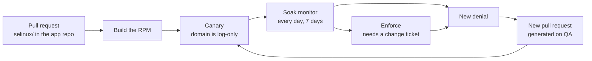
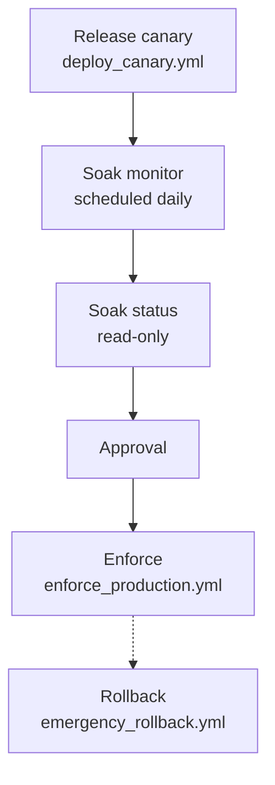
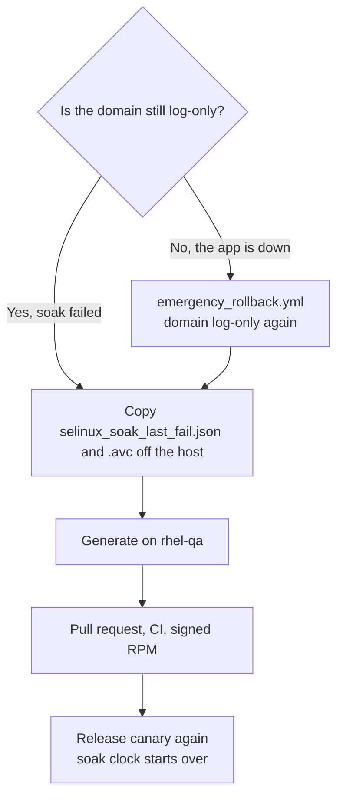

# 301 — Ship the module

This is the page after [203](../demo/203-RHEL_TWO_HOST.md). 203 shows the same jobs on two VMs. This page is how you run them for a real app: where the files live, which job to click, and what to do when a denial shows up.

Production does not get a git clone. A pull request is reviewed, an RPM is built, and **Ansible Automation Platform (AAP)** installs it. The same YAML runs as `ansible-playbook` on a laptop until AAP is wired up.



The host stays **Enforcing** the whole time. Canary makes only the app domain log-only. Enforce removes that. A denial after ship becomes another pull request. It does not become `semodule -i` typed on the server.

## Where policy lives

| Place | What it holds |
|-------|----------------|
| **The app's git repo** | `selinux/` (`.te`, `.fc`, `policy_version.txt`) and `config/<app>.manifest.yml`. Policy pull requests land here. |
| **This repo (or your fork)** | The generator, the playbooks, and the `selinux-policy-ops` package. Not the live allow list for your product. |
| **rhel-qa** | The app build, the audit log, and `dev_generate_policy.sh`. Compile here. |
| **Production** | RPMs and AAP. No git clone. |

Copy [`.github/workflows/selinux-policy-ci.yml`](../../.github/workflows/selinux-policy-ci.yml) into the app repo. It runs `forbidden-patterns` and `version-consistency` on changes under `selinux/`. Compile and canary stay on rhel-qa and AAP. GitHub does not deploy.

## Vendor module already exists

Before anyone generates a module for Tomcat, JBoss, httpd, named, or PostgreSQL, check whether Red Hat already ships that domain. A second module that half-copies `jws6_tomcat` or `jboss_t` is worse than no custom policy. The generator refuses that path unless you pass `--force "reason"`. The reason is written on the pull request. Bare `--force` is rejected.

```bash
sudo semodule -l
rpm -qa '*selinux*'
ps -eZ | grep -E 'unconfined_java_t|unconfined_service_t'
```

| What you find | What you do |
|---------------|-------------|
| The vendor module is already loaded (`jws6_tomcat`, `jboss`, `httpd`) | `dev_generate_policy.sh --tune-report`. Run the printed `semanage` and `setsebool` commands. Do not generate. |
| The vendor SELinux RPM is installed and the module is not loaded | Enable that package. Do not generate. |
| The RPM is available and not installed | `dnf install` it (`jws6-tomcat-selinux`, `eap7-selinux`, or `eap8-selinux`). Do not generate. |
| Tomcat or JBoss is `unconfined_java_t` | The vendor package was never enabled. Install it. Do not generate. |
| No vendor module (Spring Boot, Node, shopapi) | Generate. |

JWS and EAP policy is a separate package. It is not installed with the server. Until it is, the JVM runs `unconfined_java_t`. That is not confinement.

## The jobs

Playbook details live in [`ansible/README.md`](../../ansible/README.md). Click-create the AAP objects from [`ansible/aap/`](../../ansible/aap/).



| Job | Playbook | When |
|-----|----------|------|
| **SELinux – Canary** | `deploy_canary.yml` | After the RPM exists. Installs the module and leaves the app domain log-only. |
| **SELinux – Soak monitor** | `soak_monitor.yml` | Every day on the canary group. Fails when a new access shows up. |
| **SELinux – Soak status** | `soak_status.yml` | First step of **Promote to enforce**. Reads the clock. Changes nothing. |
| **SELinux – Enforce** | `enforce_production.yml` | After approval. Removes the log-only switch. |
| **SELinux – Rollback** | `emergency_rollback.yml` | The app is down. Puts the domain back to log-only. Not on the promote graph. |

Attach [`ansible/aap/survey_enforce.json`](../../ansible/aap/survey_enforce.json) to the Enforce job. `change_ticket` is required. `force_enforce` defaults to false.

| Variable | Usual value | What it does |
|----------|-------------|--------------|
| `change_ticket` | `CHG123` | Required. Enforce fails when this is empty. |
| `app_name` | `shopapi` | Also read from the manifest. |
| `app_manifest_path` | `/etc/shopapi/selinux-manifest.yml` | Shipped in the app RPM. |
| `selinux_pac_package` | `shopapi-selinux-1.0.1` | Version from `policy_version.txt`. |
| `soak_max_net_new` | `0` | Soak fails when a new access appears. |
| `soak_min_days` | `7` on prod, `0` on the lab QA inventory | How long canary must run before enforce. |
| `force_enforce` | `false` | Skips the day count. Still needs a change ticket. The 203 recording sets it true. A real shop leaves it false. |
| `rollback_dnf_version` | previous NVR | Optional RPM downgrade during rollback. |

**Release canary** is the Canary job. **Promote to enforce** is Soak status, then approval, then Enforce. Attach an AAP notification to Soak monitor (job failed) so a new denial pages someone. The failed job does not change the host.

Production inventory (`ansible/inventory.production.example.yml`) sets `selinux_ops_from_package: true`, points the manifest at `/etc/<app>/selinux-manifest.yml`, and leaves `policy_pp_src` empty because the module comes from the RPM. The lab QA inventory (`inventory.dev.example.yml`) uses the git checkout and `soak_min_days: 0`. Do not copy that zero onto production.

## Soak

Canary installs the module, writes `/var/lib/<app>/selinux_canary_deployed_at`, and adds only that domain to the permissive list. The operating system stays Enforcing. `semodule -DB` turns off dontaudit rules for the **whole host** so soak can see every denial. Enforce and rollback run `semodule -B` to put dontaudit back. If you canary and never enforce, `-DB` stays until you do.

```bash
ansible-playbook -i ansible/inventory.production.yml ansible/deploy_canary.yml --limit canary
```

A good run ends `failed=0`. The service process is the app domain (`shopapi_t`), not `init_t`. HTTP checks pass. Recent AVC count for that domain is 0, unless you raised `canary_max_avc` on purpose. Do not raise it to hide a missing allow.

Then wait. Production inventory wants **7 days**. Schedule Soak monitor daily:

```bash
ansible-playbook -i ansible/inventory.production.yml ansible/soak_monitor.yml --limit canary
ansible-playbook -i ansible/inventory.production.yml ansible/soak_status.yml --limit canary
```

On the host, the same check is `/usr/libexec/selinux-policy-ops/monitor_avc.sh` with `--max-net-new 0`. That script is in the `selinux-policy-ops` RPM. Do not clone this repo onto the server to run it.

**Net-new** means an access the installed policy does not already allow. Repeated lines for an access that is already allowed do not fail the gate. `sesearch` does that comparison. `setools-console` is a requirement of `selinux-policy-ops`. Canary, soak, and enforce fail when `sesearch` is missing.

After install, confirm labels before you treat the canary as healthy:

```bash
sudo bash scripts/verify_file_contexts.sh \
  --install-root /opt/shopapi \
  --var-dir /var/lib/shopapi \
  --log-dir /var/log/shopapi \
  --app-name shopapi
```

`File context verification passed` is the good line. An error names a path `restorecon` would still change.

Before you enforce, confirm:

- [ ] Canary has run at least 7 days (`soak_min_days` on the production inventory)
- [ ] Soak monitor has been clean across a business cycle, including a weekend
- [ ] `verify_file_contexts.sh` passed after the last canary
- [ ] The service is active and the health URL returns 200
- [ ] `semanage permissive -l` still lists the app domain
- [ ] `setools-console` is installed (`sesearch` is present)
- [ ] A change ticket names the enforce window and who runs rollback
- [ ] The policy pull request was reviewed

## Enforce

```bash
ansible-playbook -i ansible/inventory.production.yml ansible/enforce_production.yml \
  -e change_ticket=CHG123
```

Soak status runs first inside **Promote to enforce**. Enforce removes the domain from the permissive list and runs the smoke tests again. `semanage permissive -l` no longer shows the domain. `getenforce` is still `Enforcing`.

Leave `force_enforce` false. The 203 talk sets `-e force_enforce=true` so a recording can continue the same day. That flag still requires `change_ticket`.

## A denial after ship



Do not run Enforce while soak is failing. Do not run `setenforce 0`. Do not pipe `audit2allow` into `semodule` on the server.

1. If the app is already enforcing and down, run **SELinux – Rollback** first. The domain is log-only again, the host stays Enforcing, and an optional `rollback_dnf_version` downgrades the RPM. [203](../demo/203-RHEL_TWO_HOST.md) shows this after `/feature-spool` returns 500.
2. Copy `/var/lib/<app>/selinux_soak_last_fail.json` and `selinux_soak_last_fail.avc` off the host.
3. On rhel-qa, run `bash scripts/dev_generate_policy.sh`. If the vendor check says the app is already covered, re-run with `--tune-report` and apply those host commands. Use `--force "reason"` only when the app really is not the vendor one.
4. Open the pull request on the **app** repo. CI runs forbidden-patterns and version-consistency.
5. Build the RPM and run **Release canary** again. The soak clock starts over.

| The denial | Change this in git | Leave this off the server as the lasting fix |
|------------|--------------------|-----------------------------------------------|
| A file path | `.fc`, then `restorecon` from the canary | A one-off `semanage fcontext` on the box |
| A port bind | `selinux_ports` in the manifest | A one-off `semanage port -a` on the box |
| A boolean | `setsebool` on the host, documented in the ticket | A raw allow that copies the boolean into the `.te` |
| A new permission | An `allow` in the `.te`, after forbidden-patterns | `audit2allow` piped to `semodule -i` |

`generate_emergency_patch.yml` runs on the controller, in a git checkout. It writes `policy_out/` for that pull request. It does not install a module on a production host.

## Roll this out

- [ ] App repo has `selinux/`, `config/<app>.manifest.yml`, and Policy CI. Bind ports live in `selinux_ports`. The probe address lives in inventory.
- [ ] CODEOWNERS (or a required check) covers `selinux/` so an app-only merge cannot skip forbidden-patterns.
- [ ] `bash scripts/setup_rhel_hosts.sh write --qa-host … --prod-host …`, then `ping` and `doctor`.
- [ ] Signed RPM repo: `cp packaging/internal.env.example packaging/internal.env` and `bash packaging/publish_internal.sh`.
- [ ] AAP project points at `ansible/`. Job templates and workflows come from [`ansible/aap/`](../../ansible/aap/).
- [ ] Soak monitor is scheduled daily, with a notification on job failure.
- [ ] Production hosts have `selinux-policy-ops` and `setools-console`, and no git clone.

`bash scripts/selinux_pac_adopt.sh init <app>` lays down the manifest and policy directory for a new app. The first confine on QA is [201 — Add an application](../demo/201-CODE_WALKTHROUGH.md#add-an-application). The two-VM rehearsal is [203](../demo/203-RHEL_TWO_HOST.md).

## When something fails

| What you see | What to do |
|--------------|------------|
| `Soak period not met` | Wait. Do not set `force_enforce` to skip the clock without a ticket that says so. |
| `net_new_count` greater than 0 | Follow [A denial after ship](#a-denial-after-ship). Recanary resets the clock. |
| `verify_file_contexts.sh` names a path | `restorecon -Rv` on the app's install, state, log, and run directories, then run the check again. |
| `Canary marker not found` | Run `deploy_canary.yml`. The marker is written there. |
| `Could not determine AVC count` | Install `audit` and confirm `auditd` is running. |
| `sesearch` missing | Install `setools-console`. The playbooks stop on purpose. |
| App fails after enforce | Run **SELinux – Rollback**. The domain is log-only again. Then the pull-request path above. |
| Generator says vendor policy is loaded | `--tune-report`, or install the vendor SELinux RPM. See [Vendor module already exists](#vendor-module-already-exists). |
| `Could not match supplied host pattern` | Copy `inventory.production.example.yml` to `inventory.production.yml` and set the real host names. |
