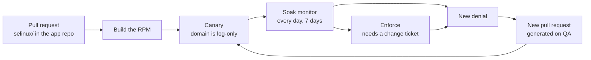
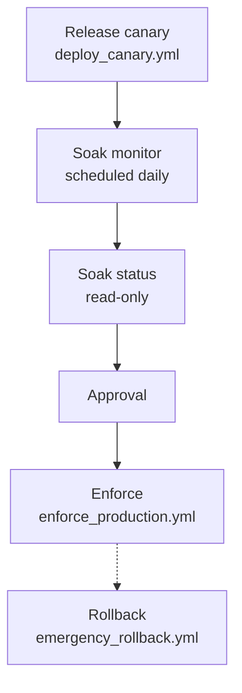
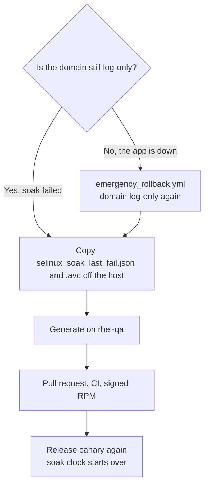

# 401 — Ship the module

This is the page after [302](../demo/302-TECHNICAL.md). 302 shows the same jobs on two VMs. This page is how you run them for a real app: where the files live, which job to click, and what to do when a denial shows up. Commands were taught in [102](../training/102-COMMANDS.md). The playbook-to-command map is [201](../tool/201-TOOL-COMMANDS.md).

Production does not get a git clone. A pull request is reviewed, an RPM is built, and **Ansible Automation Platform (AAP)** installs it. The same YAML runs as `ansible-playbook` on a laptop until AAP is wired up.



The host stays **Enforcing** the whole time. Canary makes only the app domain log-only. Enforce removes that. A denial after ship becomes another pull request. It does not become `semodule -i` typed on the server.

| Command | Where you type it |
|---------|-------------------|
| `ansible-playbook` | The controller: your laptop, or an AAP job. The inventory file is on this machine. |
| `dev_generate_policy.sh` | **rhel-qa**, in a git checkout. |
| `verify_file_contexts.sh`, `semanage`, `getenforce` | The **production** host. Use `/usr/libexec/selinux-policy-ops/`. There is no git checkout there. |

## Where policy lives

| Place | What it holds |
|-------|----------------|
| **The app's git repo** | `selinux/` (`.te`, `.fc`, `policy_version.txt`) and `config/<app>.manifest.yml`. Policy pull requests land here. |
| **This repo (or your fork)** | The generator, the playbooks, and the `selinux-policy-ops` package. Not the live allow list for your product. |
| **rhel-qa** | The app build, the audit log, and `dev_generate_policy.sh`. Compile here. |
| **Production** | RPMs and AAP. No git clone. |

Policy CI for an app repo calls [`.github/workflows/selinux-policy-app.yml`](../../.github/workflows/selinux-policy-app.yml). That file is `workflow_call` only. In a called workflow the `github` context is the caller's, so the tools repo and ref are inputs. Copying [`.github/workflows/selinux-policy-ci.yml`](../../.github/workflows/selinux-policy-ci.yml) into the app repo does not work: `make test` and the validators live here, not next to the app.

Put this in the app repo as `.github/workflows/selinux-policy.yml`. `OWNER/selinux-pac` is the fork you trust, and `REF` is a commit or tag on that fork. Pass the same ref as `tools_ref` so the scripts match the workflow file. The app repo's token must be able to read it. GitHub does not deploy.

```yaml
name: SELinux policy
on:
  pull_request:
  push:
    branches: [main]
jobs:
  policy:
    uses: OWNER/selinux-pac/.github/workflows/selinux-policy-app.yml@REF
    with:
      policy_dir: selinux/shopapi
      module: shopapi
      domain: shopapi_t
      tools_repo: OWNER/selinux-pac
      tools_ref: REF
```

`policy_dir` is the directory that contains `shopapi.te` and `policy_version.txt`. The called jobs check out the app and this repo, then run forbidden-patterns, `cli/policy_audit.py`, version consistency, and the Stream 9 compiled check against that directory. Canary stays on AAP.

## Vendor module already exists

Before anyone generates a module for Tomcat, JBoss, Apache httpd, BIND, or PostgreSQL, check whether Red Hat already ships that domain. A second module that half-copies `jws6_tomcat` or `jboss_t` is worse than no custom policy. The generator refuses that path unless you pass `--force "reason"`. The reason is written on the pull request. Bare `--force` is rejected.

RHEL 9 base policy module names are the `policy_module()` argument, which is what `semodule -l` prints. [apache.te](https://github.com/fedora-selinux/selinux-policy/blob/c9s/policy/modules/contrib/apache.te) is `apache` (domain `httpd_t`). [bind.te](https://github.com/fedora-selinux/selinux-policy/blob/c9s/policy/modules/contrib/bind.te) is `bind` (domain `named_t`). There is no `policy/modules/contrib/jboss.te` on the `c9s` branch. Confined JBoss/EAP comes from `eap7-selinux` or `eap8-selinux`, not from a base module named `jboss`.

```bash
sudo semodule -l
rpm -qa '*selinux*'
ps -eZ | grep -E 'unconfined_java_t|unconfined_service_t'
```

| What you find | What you do |
|---------------|-------------|
| The vendor module is already loaded (`jws6_tomcat`, `apache`, `bind`, `postgresql`) | `dev_generate_policy.sh --tune-report`. Run the printed `semanage` and `setsebool` commands. Do not generate. `apache` confines `httpd_t`. `bind` confines `named_t`. |
| Module `tomcat` is loaded and `seinfo -t tomcat_t -x` shows `unconfined_domain_type` | This is the Tomcat that comes with RHEL. The type name exists and the rules do not deny. Do not generate a second module. Do not expect a denial to tune. The confined package is `jws6-tomcat-selinux`. |
| Loaded vendor module whose domain is unconfined (`situation=loaded_unconfined`, `action=confine`) | Install the vendor's confining package, or generate with `--force "reason"`. Do not tune denials this domain will not produce. |
| The vendor SELinux RPM is installed and the module is not loaded | Enable that package. Do not generate. |
| The RPM is available and not installed | `dnf install` it (`jws6-tomcat-selinux`, `eap7-selinux`, or `eap8-selinux`). Do not generate. |
| Tomcat or JBoss is `unconfined_java_t` | The vendor package was never enabled. Install it. Do not generate. |
| No vendor module (Spring Boot, Node, shopapi) | Generate. |

JWS and EAP policy is a separate package. It is not installed with the server. Until it is, the JVM runs `unconfined_java_t`. That is not confinement.

## Booleans

A boolean the app needs goes in the manifest. Canary applies each entry with `ansible.posix.seboolean` after the module is installed and before the service starts. `state` is `true` or `false`. `persistent` defaults to true.

```yaml
selinux_booleans:
  - name: tomcat_read_rpm_db
    state: true
```

`tomcat_read_rpm_db` is a tunable in [tomcat.te](https://github.com/fedora-selinux/selinux-policy/blob/c9s/policy/modules/contrib/tomcat.te). The same file has `tomcat_can_network_connect_db` and `tomcat_use_execmem`. It does not have `tomcat_can_network_connect`. The manifest check rejects that name. It also rejects `httpd_can_network_connect` when the domain is `tomcat_t` or a `*_tomcat_t` domain. That boolean belongs to the apache module.

## The jobs

Playbook details live in [`ansible/README.md`](../../ansible/README.md). Click-create the AAP objects from [`ansible/aap/`](../../ansible/aap/).



| Job | Playbook | When |
|-----|----------|------|
| **SELinux – Canary** | `deploy_canary.yml` | After the RPM exists. Installs the module and leaves the app domain log-only. |
| **SELinux – Soak monitor** | `soak_monitor.yml` | Every day on the canary group. Fails when a new access shows up. |
| **SELinux – Soak status** | `soak_status.yml` | First step of **Promote to enforce**. Reads the clock. Changes nothing. |
| **SELinux – Enforce** | `enforce_production.yml` | After approval. Removes the log-only switch. |
| **SELinux – Rollback** | `emergency_rollback.yml` | The app is down. Puts the domain back to log-only. Not on the promote graph. |

Attach [`ansible/aap/survey_enforce.json`](../../ansible/aap/survey_enforce.json) to the Enforce job. `change_ticket` is required. `force_enforce` defaults to false.

| Variable | Usual value | What it does |
|----------|-------------|--------------|
| `change_ticket` | `CHG123` | Required. Enforce fails when this is empty. |
| `app_name` | `shopapi` | Also read from the manifest. |
| `app_manifest_path` | `/etc/shopapi/selinux-manifest.yml` | Installed by the `shopapi-selinux` RPM, on the production host. |
| `selinux_pac_package` | leave unset | The playbook reads `selinux/shopapi/policy_version.txt` on the controller and installs `shopapi-selinux-<that version>`. |
| `soak_max_net_new` | `0` | Soak fails when a new access appears. |
| `soak_min_days` | `7` on prod, `0` on the lab QA inventory | How long canary must run before enforce. |
| `skip_soak_days` | `false` | Skips only the day count and the daily history files under `daily/`. The marker, the AVC gate, net-new, and the report still run. The 302 clean-soak enforce sets it true. |
| `force_enforce` | `false` | Skips the marker, the AVC gate, net-new, the report, the day count, and the daily history. Requires `break_glass_reason`, which the deploy report records. Still needs a change ticket. The 302 outage sets it true. A real shop leaves it false. |
| `rollback_dnf_version` | previous NVR | Optional RPM downgrade during rollback. |

**Release canary** is the Canary job. **Promote to enforce** is Soak status, then approval, then Enforce. Attach an AAP notification to Soak monitor (job failed) so a new denial pages someone. The failed job does not change the host.

Production inventory (`ansible/inventory.production.example.yml`) sets `selinux_ops_from_package: true`, points the manifest at `/etc/<app>/selinux-manifest.yml`, and leaves `policy_pp_src` empty because the module comes from the RPM. The lab QA inventory (`inventory.dev.example.yml`) uses the git checkout and `soak_min_days: 0`. Do not copy that zero onto production.

## Soak

Do these once, on the controller, before the first playbook. `inventory.production.yml` is gitignored. The example host name is `rhel-prod.example.com`. Change `ansible_host` to the real address. The `canary` group is what `--limit canary` selects. The `shopapi-selinux` RPM and `selinux-policy-ops` must already be in the dnf repo the host uses ([Roll this out](#roll-this-out)).

```bash
cp ansible/inventory.production.example.yml ansible/inventory.production.yml
```

Canary installs the module, writes `/var/lib/selinux-policy-ops/shopapi/selinux_canary_deployed_at`, and adds only `shopapi_t` to the permissive list. The operating system stays Enforcing. That directory is `root:root` mode `0755`. The app cannot rewrite the marker while its domain is permissive. `semodule -DB` turns off dontaudit rules for the **whole host** so soak can see every denial. Enforce and rollback run `semodule -B` to put dontaudit back, unless another app still has a marker under `/var/lib/selinux-policy-ops/`. A successful enforce archives this app's marker to `selinux_canary_deployed_at.enforced`. If that file stayed in place, every later `semodule -B` would treat the app as still soaking. If you canary and never enforce, `-DB` stays until you do. Soak status warns when any marker there is older than 30 days. It does not delete it. Each Soak monitor run stores that day's JSON in `/var/lib/selinux-policy-ops/shopapi/daily/`. Enforce needs that many consecutive passing days, and the newest file has to be from today or yesterday. A later clean reading of `audit.log` does not erase a stored failure.

Type this on the controller:

```bash
ansible-playbook -i ansible/inventory.production.yml ansible/deploy_canary.yml --limit canary
```

A good run ends `failed=0`. The service process is the app domain (`shopapi_t`), not `init_t`. HTTP checks pass. Recent AVC count for that domain is 0, unless you raised `canary_max_avc` on purpose. Do not raise it to hide a missing allow.

Then wait. Production inventory wants **7 days**. Schedule Soak monitor daily. Both commands are on the controller. Soak status only reads the clock. Run it when you want to see the day count. It does not change the host.

```bash
ansible-playbook -i ansible/inventory.production.yml ansible/soak_monitor.yml --limit canary
ansible-playbook -i ansible/inventory.production.yml ansible/soak_status.yml --limit canary
```

On the production host, the same check is `/usr/libexec/selinux-policy-ops/monitor_avc.sh` with `--max-net-new 0`. That script is in the `selinux-policy-ops` RPM. Do not clone this repo onto the server to run it.

**Net-new** means an access the installed policy does not already allow. Repeated lines for an access that is already allowed do not fail the gate. `sesearch` does that comparison. `setools-console` is a requirement of `selinux-policy-ops`. The soak gate fails closed when `sesearch` is missing. It does not report a clean window. Day 0 installs the RPM (`dnf`), which lands the module at priority 200. It does not `semodule -i` a loose `.pp` at priority 400.

Canary already runs the label check on the host before it restarts the service. To see that line yourself, SSH to production and run the copy that the RPM installed:

```bash
sudo /usr/libexec/selinux-policy-ops/verify_file_contexts.sh \
  --install-root /opt/shopapi \
  --var-dir /var/lib/shopapi \
  --log-dir /var/log/shopapi \
  --app-name shopapi
```

`File context verification passed for shopapi` is the good line. An error names a path `restorecon` would still change.

Before you enforce, confirm:

- [ ] Canary has run at least 7 days (`soak_min_days` on the production inventory)
- [ ] Soak monitor has been clean across a business cycle, including a weekend
- [ ] `/usr/libexec/selinux-policy-ops/verify_file_contexts.sh` passed after the last canary
- [ ] The service is active and the health URL returns 200
- [ ] `semanage permissive -l` still lists the app domain
- [ ] `setools-console` is installed (`sesearch` is present)
- [ ] A change ticket names the enforce window and who runs rollback
- [ ] The policy pull request was reviewed

## Enforce

On the controller:

```bash
ansible-playbook -i ansible/inventory.production.yml ansible/enforce_production.yml \
  --limit canary \
  -e change_ticket=CHG123
```

This playbook checks the soak gate itself: the canary marker exists, at least 7 days have passed, net-new is 0, and the deploy report passed. In AAP, the workflow **Promote to enforce** runs Soak status, then an approval, then this same playbook.

Enforce removes `shopapi_t` from the permissive list and runs the smoke tests again. On the host, `semanage permissive -l` no longer shows that domain. `getenforce` is still `Enforcing`.

Leave both flags false on a real shop. The 302 clean-soak enforce sets `-e skip_soak_days=true`, which skips only the day count and the daily history. The outage sets `-e force_enforce=true` with `-e break_glass_reason=...`, which skips the marker, the AVC gate, net-new, the report, the day count, and the daily history, and records that reason. Both still require `change_ticket`.

## A denial after ship



Do not run Enforce while soak is failing. Do not run `setenforce 0`. Do not pipe `audit2allow` into `semodule` on the server.

1. If the app is already enforcing and down, run **SELinux – Rollback** first. The domain is log-only again, the host stays Enforcing, and an optional `rollback_dnf_version` downgrades the RPM. [302](../demo/302-TECHNICAL.md) enforces the first module with break-glass so `/feature-spool` returns 500, rolls back, and only then generates the fix. The talk ends enforcing.
2. Copy `/var/lib/selinux-policy-ops/<app>/selinux_soak_last_fail.json` and `selinux_soak_last_fail.avc` off the host.
3. On rhel-qa, run `bash scripts/dev_generate_policy.sh`. If the vendor check says the app is already covered, re-run with `--tune-report` and apply those host commands. Use `--force "reason"` only when the app really is not the vendor one.
4. Open the pull request on the **app** repo. The reusable workflow runs forbidden-patterns, the source audit, version consistency, and the Stream 9 compiled check.
5. Build the RPM and run **Release canary** again. The soak clock starts over.

| The denial | Change this in git | Leave this off the server as the lasting fix |
|------------|--------------------|-----------------------------------------------|
| A file path | `.fc`, then `restorecon` from the canary | A one-off `semanage fcontext` on the box |
| A port bind | `selinux_ports` in the manifest | A one-off `semanage port -a` on the box |
| A boolean | `selinux_booleans` in the manifest. Canary applies it with `ansible.posix.seboolean` before the service starts. | A raw allow that copies the boolean into the `.te`, or `httpd_can_network_connect` on Tomcat |
| A new permission | An `allow` in the `.te`, after forbidden-patterns | `audit2allow` piped to `semodule -i` |

`generate_emergency_patch.yml` runs on the controller, in a git checkout. It writes `policy_out/` for that pull request. It does not install a module on a production host.

## Roll this out

- [ ] App repo has `selinux/`, `config/<app>.manifest.yml`, and Policy CI. Bind ports live in `selinux_ports`. The probe address lives in inventory.
- [ ] CODEOWNERS (or a required check) covers `selinux/` so an app-only merge cannot skip forbidden-patterns.
- [ ] `bash scripts/setup_rhel_hosts.sh write --qa-host … --prod-host …`, then `ping` and `doctor`.
- [ ] Signed RPM repo: `cp packaging/internal.env.example packaging/internal.env` and `bash packaging/publish_internal.sh`.
- [ ] AAP project points at `ansible/`. Click-create from [`ansible/aap/`](../../ansible/aap/), or apply [`ansible/aap/aap_configuration.yml`](../../ansible/aap/aap_configuration.yml) with `infra.aap_configuration`. That file creates the job templates, both workflows, the enforce survey, and the daily soak schedule.
- [ ] Soak monitor is scheduled daily, with a notification on job failure.
- [ ] Production hosts have `selinux-policy-ops` and `setools-console`, and no git clone.

`bash scripts/selinux_pac_adopt.sh init <app>` lays down the manifest and policy directory for a new app. The first confine on QA is [201 — Add an application](../tool/201-TOOL-COMMANDS.md#add-an-application). The two-VM rehearsal is [302](../demo/302-TECHNICAL.md).

## When something fails

| What you see | What to do |
|--------------|------------|
| `Soak not met` | Wait. The message prints days elapsed and the number it wanted. Do not set `force_enforce` to skip the clock without a ticket that says so. |
| `Net-new access needs` exceed the threshold | Follow [A denial after ship](#a-denial-after-ship). Recanary resets the clock. |
| `/usr/libexec/selinux-policy-ops/verify_file_contexts.sh` names a path | On the host: `restorecon -Rv` on `/opt/shopapi`, `/var/lib/shopapi`, `/var/log/shopapi`, and `/run/shopapi`, then run that same packaged script again. There is no `scripts/` tree on production. |
| `Canary marker missing` | Run `deploy_canary.yml`. The marker is `/var/lib/selinux-policy-ops/shopapi/selinux_canary_deployed_at`. |
| `Soak daily history not met` | A day under `/var/lib/selinux-policy-ops/shopapi/daily/` is missing or failed. Wait for the next Soak monitor, or fix the denial and recanary. |
| `Soak AVC monitor failed closed` | The monitor crashed or could not count net-new access. Install `setools-console` and `audit`. Do not enforce on a count of zero. |
| `No ausearch or /var/log/audit/audit.log available` | Install `audit` and confirm `auditd` is running. |
| `sesearch` missing | Install `setools-console`. The playbooks stop on purpose. |
| App fails after enforce | Run **SELinux – Rollback**. The domain is log-only again. Then the pull-request path above. |
| Generator says vendor policy is loaded | `--tune-report`, or install the vendor SELinux RPM. See [Vendor module already exists](#vendor-module-already-exists). |
| `Could not match supplied host pattern` | Copy `inventory.production.example.yml` to `inventory.production.yml` and set the real host names. |
