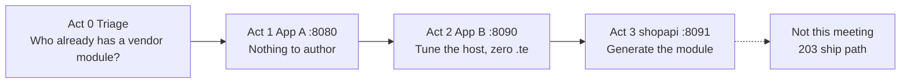
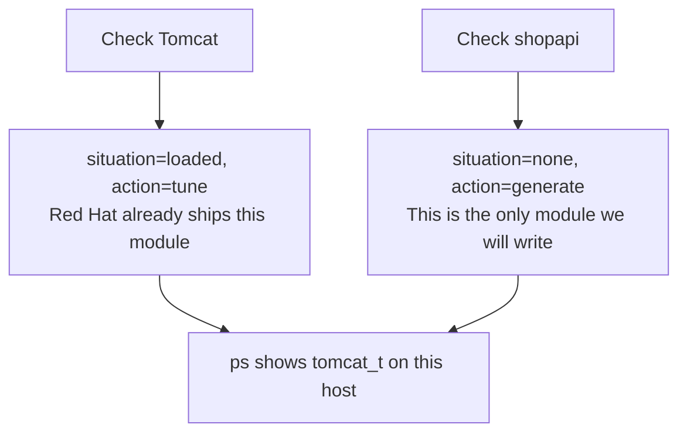
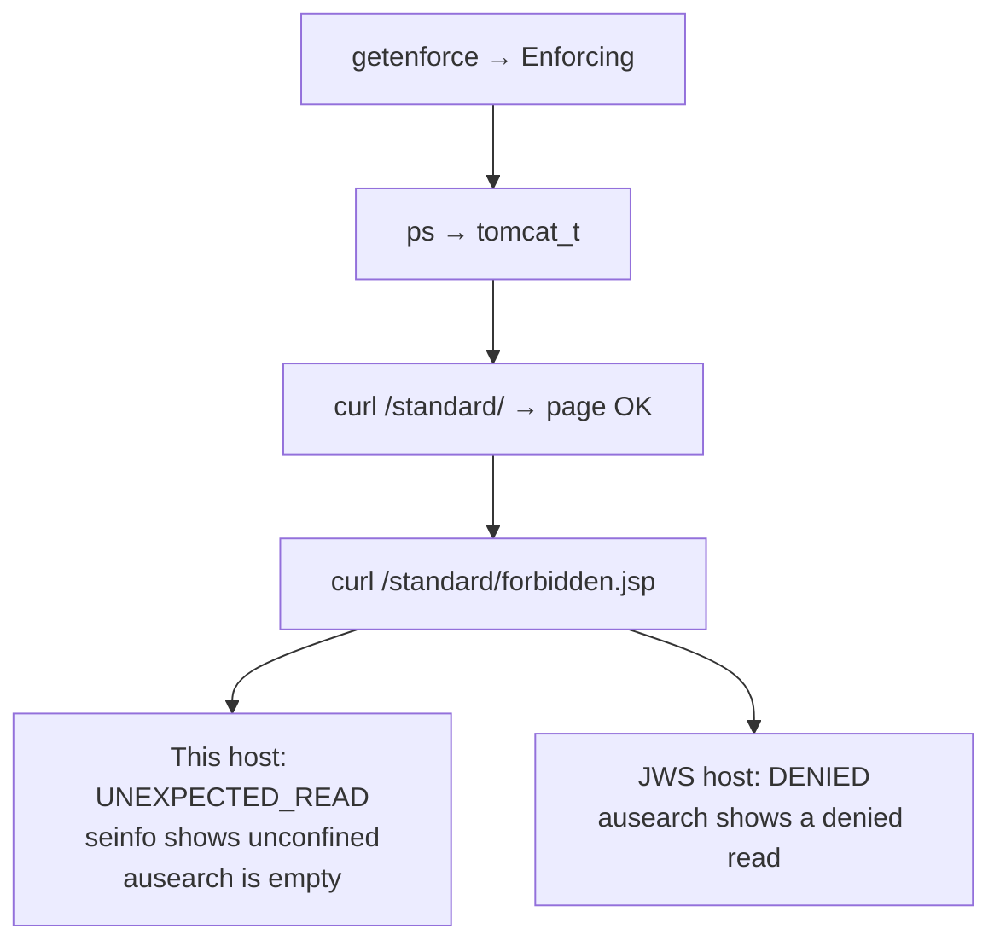
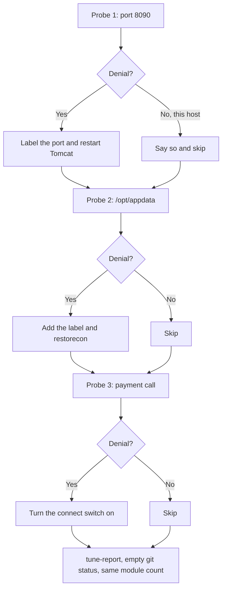
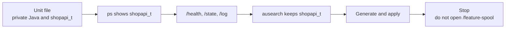

# 202 — Three-app customer talk

**Finish [101](../training/101-SELINUX.md) before Acts 0–3.** That guide is the typed shopapi loop (one AVC, generate, same URL adds no rule, new URL fails under enforcing). This talk assumes those commands.

**LAST_VERIFIED:** 2026-09-18 — live on RHEL with distro Tomcat (`tomcat_t`) + JDK 17. JWS 6 + `jws6-tomcat-selinux` is still the confined App A/B path.

## Which demo

This repo has **two** talk tracks. They overlap on canary / soak / PR. They are not interchangeable. Pick one per audience:

| | Audience | Setup | Length | Command |
|---|----------|--------|--------|---------|
| **This guide (202)** | Customer / first conversation | One RHEL host | ~20 min | `bash scripts/demo_present.sh` |
| **[203](203-RHEL_TWO_HOST.md)** | Technical deep dive — proof the ship path is real | Mac + rhel-qa + rhel-prod | ~45 min | `bash scripts/demo_e2e_mac.sh` |

Today's meeting is the first row. One sentence for the room: some apps need nothing, some need a one-line host fix, and one app needs a new policy module.

Use `--profile customer`. That is Acts 0, 1, 2, and 3, about 20 minutes. `--profile technical` adds Act 4 (open a pull request) and Act 5 (a pointer at the 203 talk). Act 5 does not run the 203 talk.

On a laptop, `--dry-run` prints this talk and runs nothing. `make check` runs the offline tests, including a dry-run of both talk scripts. The sample module in those tests is `selinux/myapp.te`. Nothing starts an application.



| Act | What you show | Where you stop |
|-----|----------------|----------------|
| **0** | Tomcat already has a Red Hat module. Shopapi does not. | You do not write a policy file for Tomcat. |
| **1** | The normal page on port 8080 works. The forbidden page is the proof. | You do not change anything. |
| **2** | A second Tomcat on port 8090, files in `/opt/appdata`, and a call out to a payment service. | You do not write a policy file. `git status` of `selinux/` stays empty. |
| **3** | Shopapi on port 8091. Curl `/health`, `/state`, and `/log`, then generate the module from those denials. | You do not open `/feature-spool`. That failure is the next meeting. |

The next meeting, when they want Ansible, RPMs, and the soak gate, is [203-RHEL_TWO_HOST.md](203-RHEL_TWO_HOST.md).

If you run `--help` on either talk script, the help text names the other script. The customer story is edited in `scripts/demo_present.sh`. The two-VM story is edited in `scripts/demo_e2e_mac.sh`, `demo_e2e_rhel_qa.sh`, and `demo_e2e_rhel_prod.sh`.

## The three apps

Customers run Tomcat, JBoss, Python, Node, and Spring Boot. Red Hat already ships policy for some of those. This talk uses three apps so a listener can point at their own:

| App | The story you tell | What you do on screen |
|-----|--------------------|------------------------|
| **App A** | Tomcat installed the normal way, on port **8080**. | Show that it is already running. Change nothing. |
| **App B** | A second Tomcat. Port 8080 was taken, so it listens on **8090**. Its files were dropped in `/opt/appdata`. It calls a payment service. | Fix the host with one command per problem, or say there was no denial. Write no policy file. |
| **shopapi** | A Spring Boot service started by systemd. Red Hat does not ship a module for it. | This is the only app that gets a new `.te`. |

App A and App B share one process type, `tomcat_t` or `jws6_tomcat_t`. SELinux treats them as the same kind of program. To keep them apart, run them as separate Tomcat instances or in containers.

**What this RHEL host will show.** Bootstrap installs the Tomcat that comes with RHEL. Its type is `tomcat_t`. A module named `tomcat` is loaded, and that type still does not confine the process. In Act 1 the forbidden page is readable (`UNEXPECTED_READ`) and there is no denial. In Act 2 the three probes produce no denial, so you skip the fixes and say so. Say that out loud. It is the honest result on this host.

JBoss Web Server (JWS) is the paid Tomcat. Its type is `jws6_tomcat_t`, and that type does confine. On a JWS host Act 1 shows a real denial, and Act 2 shows the one-line port, label, and boolean fixes. Bootstrap prints which Tomcat it installed.

Shopapi is confined on either kind of host. Act 3 is the same story both ways.

## Commands

You narrate. The script types the act commands and pauses. Press Enter when it says `Press Enter for the next step`. Do not type the act commands yourself while it is running.

On a laptop, with no RHEL, this prints the narration and the commands and runs nothing:

```bash
bash scripts/demo_present.sh --dry-run --profile customer
```

### Order for the meeting

**1. On the Mac**, only when this VM already ran **101**. The script SSHs to rhel-qa. It puts the types-only shopapi seed back, clears the audit log (so Act 3 does not compile-fail on the old `bin_t` entrypoint denial), and removes the three App B tunings so Act 2 still has something to show.

```bash
bash scripts/reset_demo_vms.sh --dev-only
```

**2. On rhel-qa**, from the repo root. Bootstrap installs App A, App B, and shopapi if they are missing. It is safe to run again. It prints whether Tomcat is distro `tomcat_t` or JWS `jws6_tomcat_t`. Preflight prints a pass/fail table and exits. `Preflight PASSED` is the line you want. A WARN that distro `tomcat_t` is unconfined still passes. The last command is the talk.

```bash
sudo bash scripts/demo_bootstrap.sh
bash scripts/demo_present.sh --preflight
bash scripts/demo_present.sh --profile customer
```

| Flag | Meaning |
|------|---------|
| `--profile customer` | Acts 0–3 (~20 min): triage, App A, App B, generate shopapi |
| `--profile technical` | Customer path plus PR + a pointer at `demo_e2e_mac.sh` (does not run the three-host talk) |
| `--acts 0,1,2` | Manual act list |
| `--preflight` | Pass/fail table. Missing App A → `make demo-bootstrap`. **Already-tuned App B** (port 8090 labelled, `/opt/appdata` fcontext, or connect boolean on) is a **FAIL** — Act 2 would produce no denial. |
| `--dry-run` | Narration + commands + expected output; **executes nothing** |
| `--open-pr` | Preflight requires `gh auth` |

A second Act 2 on the same VM uses the same Mac reset as step 1, then `--preflight` again.

The three-host generate/canary/soak talk is **[203](203-RHEL_TWO_HOST.md)** (`demo_e2e_mac.sh` / `_rhel_qa.sh` / `_rhel_prod.sh`), not this script.

## What you say, command by command

`--profile customer` is Acts 0–3. Say the sentence, then let the script run the command under it. A line that starts with `Expected:` is what a good screen looks like.

### Before anyone is watching

`sudo bash scripts/demo_bootstrap.sh` stands up the three apps. Bootstrap prints whether Tomcat is distro `tomcat_t` or JWS `jws6_tomcat_t`. On this RHEL it is distro `tomcat_t`.

`bash scripts/demo_present.sh --preflight` prints a pass/fail table and exits. It does not start the talk.

| Row | Pass means | Fail means |
|-----|------------|------------|
| Enforcing | `getenforce` is Enforcing. The talk never runs `setenforce 0`. | The host is Permissive or Disabled. |
| Tomcat unit and port 8080 | App A is installed and listening. | Run bootstrap. |
| Port 8090 | Not labeled yet. **PASS** if nothing is listening. **WARN** if it is already listening with no label. That WARN is normal on this host: distro Tomcat can bind the port, so Act 2 will not show a bind denial. | **FAIL** only when the port is already labeled. Reset from the Mac. |
| App B fcontext | `/opt/appdata` has no custom mapping yet. | Already mapped. Same reset. |
| App B boolean | The outbound-connect switch is off. | It is on. Same reset. |
| App A denials | A **WARN** on distro `tomcat_t` is expected. The type is unconfined, so Acts 1 and 2 will not produce file or port denials. Shopapi in Act 3 still confines. | A missing App A is a FAIL, not this WARN. |

`Preflight PASSED` is the line you want before the meeting. A WARN on unconfined `tomcat_t` still passes.

### Act 0 — Triage (~2 min)

Say: three apps. We do not write a policy module until the third.



You do not type these. The script prints two lines. Read them aloud:

```text
[INFO] TRIAGE situation=loaded ... app=tomcat ... action=tune
[INFO] TRIAGE situation=none ... app=shopapi ... action=generate
variant=tomcat domain=tomcat_t
```

`situation=loaded` and `action=tune` means we will adjust the host later, in Act 2. `situation=none` and `action=generate` means shopapi has no Red Hat module. Then `ps` lists the SELinux label and the program name. You want `tomcat_t` on the Tomcat process. Shopapi may already show `shopapi_t` if the seed is loaded.

### Act 1 — App A (~1 min)

Say: this one was installed the normal way, on port 8080. It is already enforcing. We change nothing.



```bash
getenforce
```

One word. `Enforcing` means denials are real. The host stays this way for the whole talk.

```bash
ps -eo label,comm | grep -E 'tomcat|jsvc' | head
```

The label's third field is the process type. Distro Tomcat is `tomcat_t`. JWS is `jws6_tomcat_t`.

```bash
curl -sS http://127.0.0.1:8080/standard/
```

`-sS` hides the progress meter and still prints errors. A good page says the standard app is OK. This request is allowed.

```bash
curl -sS http://127.0.0.1:8080/standard/forbidden.jsp
```

This page reads a file the app should not read. The file is world-readable on purpose, so ordinary file permissions cannot hide an SELinux denial.

On **this** host the page returns `UNEXPECTED_READ`. Say that out loud: a module named `tomcat` is loaded, and this type does not confine.

```bash
seinfo -t tomcat_t -x | tr ',' '\n' | grep unconfined
sudo ausearch -m avc -ts recent | grep -E 'out-of-scope|user_home_t|forbidden' | tail -n 5
```

`seinfo -t tomcat_t -x` prints the attributes of that type. `tr` puts each attribute on its own line. `grep unconfined` keeps `unconfined_domain_type` or `files_unconfined_type`. The `ausearch` line is empty. That pair is the proof. We still authored nothing.

On a JWS host the same curl returns `DENIED`, and `ausearch` shows `denied { read }` for `jws6_tomcat_t`. Same closing sentence: vendor policy, already enforcing, we authored nothing.

### Act 2 — App B (~5 min)

Say: someone else already had port 8080, so this instance listens on 8090. The files landed in `/opt/appdata`. It calls a payment service. If a probe produces no denial, we say so and skip the fix. We do not invent a policy file.



On this host all three answers are **No**. The script skips every fix. The checkpoint is: zero policy file, and a JWS host would have needed the three commands below. Shopapi is still the app we will generate for. Walk the probes anyway so the audience sees the shape.

**Probe 1, the port.**

```bash
curl -sS -o /dev/null -w '%{http_code}\n' --connect-timeout 2 http://127.0.0.1:8090/inherited/ || true
```

`-o /dev/null` discards the page. `-w '%{http_code}'` prints only the status code. `--connect-timeout 2` gives up after two seconds. `|| true` keeps the script going when nothing is listening. A confined domain that cannot bind 8090 never answers.

```bash
sudo ausearch -m avc -ts recent | grep name_bind | tail -n 10
sudo ausearch -m avc -ts recent | audit2why | tail -n 30
```

`name_bind` is "may this process bind this port." `audit2why` turns the denial into a suggested fix. On a confined Tomcat the fix is:

```bash
sudo semanage port -a -t http_port_t -p tcp 8090
```

`-a` adds the port. `-t http_port_t` is the type vendor policy already allows a web server to bind. `-p tcp` is the protocol. `-m` instead of `-a` is the modify form when the port is already labeled. The script restarts Tomcat after that, then curls `/inherited/` again.

**Probe 2, the label.**

```bash
curl -sS http://127.0.0.1:8090/inherited/data.jsp || true
```

`/opt/appdata` was labeled `user_home_t` on purpose. Vendor policy does not allow the web server to read that type.

```bash
sudo semanage fcontext -a -t tomcat_var_lib_t '/opt/appdata(/.*)?'
sudo restorecon -Rv /opt/appdata
```

`fcontext -a` adds an address-book line. `-t` is the type. `(/.*)?` means the directory and everything under it. `restorecon -R` paints that type onto the files. `-v` prints each path that changed. Still no `.te`.

**Probe 3, the outbound call.**

```bash
curl -sS http://127.0.0.1:8090/inherited/gateway.jsp || true
```

A confined web server cannot open outbound connections until a boolean is on. `audit2why` names the switch. The script turns on the first one that exists:

```bash
sudo setsebool -P tomcat_can_network_connect on
```

`setsebool` flips a switch the vendor module already contains. `-P` keeps it across reboot. `on` is the value. JWS may name it `jws6_can_network_connect`. If there is no denial, the script prints `skipping` and does not invent a module.

**Proof, both variants.**

```bash
bash scripts/dev_generate_policy.sh --tune-report --app-name tomcat --unit tomcat.service
```

`--tune-report` writes `policy_out/tune_report.md` with the same host commands. It does not write a `.te`.

```bash
git status --short selinux/
sudo semodule -l | wc -l
```

`git status --short selinux/` empty means we did not edit a policy file. `semodule -l | wc -l` is the count of loaded modules. The count matches the start of the act. Say: three probes, a fix only when a denial was real, zero policy authored.

### Act 3 — shopapi (the rest of the 20 minutes)

Say: this is the first time we author a module. We declined twice. Spring Boot has no Red Hat module. The unit runs a private copy of Java at `/opt/shopapi/bin/java`, labeled `shopapi_exec_t`. `SELinuxContext=` puts the process in `shopapi_t`.



```bash
systemctl cat shopapi.service | grep -E 'SELinuxContext|ExecStart'
```

`systemctl cat` prints the unit file. `grep` keeps the two lines you want to read aloud. Expected: `ExecStart=/opt/shopapi/bin/java ...` and `SELinuxContext=system_u:system_r:shopapi_t:s0`.

```bash
ps -o label=,comm= -C java | head
```

`-C java` selects the Java process. You want `shopapi_t` on that line.

```bash
curl -sS http://127.0.0.1:8091/health || true
curl -sS http://127.0.0.1:8091/state || true
curl -sS http://127.0.0.1:8091/log || true
```

These three URLs are the first ship. The seed is types-only, and shopapi is permissive, so the requests succeed and the denials land in the audit log. Do not curl `/feature-spool` in this act. That URL is the later outage, after the first module is enforcing.

```bash
sudo ausearch -m avc -ts recent | grep shopapi_t | tail -n 20
```

`grep shopapi_t` keeps this app. Without it, leftover denials from other labs fill the screen.

```bash
sudo bash scripts/dev_generate_policy.sh --apply --allow-needs-review --app-name shopapi --app-root "$(pwd)"
```

This is the Lab 3 command. `--allow-needs-review` is already on the flag list because a JVM log usually contains `execmem` (memory that is both writable and executable). The generator records it and writes it only because the flag is present. `--apply` copies the result onto `selinux/shopapi/`. The module name stays `shopapi`.

Say: the allows came from the denials we just produced, not from a list of Java permissions. If `execmem` had not been in the log, we would not add it.

Then stop. The checkpoint on screen is: this is the first time we authored policy. We declined twice first. Acts 4 and 5 are the technical profile. They are not this meeting. The ship path is [203](203-RHEL_TWO_HOST.md).

## Remember while you talk

- App A and App B come before the generator. That order is the point.
- Act 1 always includes the forbidden page. On this host, follow it with `seinfo` and an empty `ausearch`. On JWS, follow it with the denial.
- Act 2: a probe with no denial is a spoken skip. `--tune-report` writes those same host commands into `policy_out/tune_report.md` and does not write a `.te`. Close on the empty `git status` and the unchanged module count.
- Shopapi allows come from the denials just produced. `execmem` is written only because it was in the log and `--allow-needs-review` is on the command. The shared `/usr/bin/java` is `bin_t` and cannot be the program that enters `shopapi_t`. The private copy can.
- Do not open `/feature-spool` in this meeting.

## Self-service

| Who | Path |
|-----|------|
| New to SELinux | [101-SELINUX.md](../training/101-SELINUX.md) first, then this talk. |
| Us (maintained host) | App A persists. `--preflight` the night before. Act 1 is evidence. |
| Colleague on a throwaway VM | `make demo-bootstrap` (idempotent; resume after Ctrl-C). |
| Customer after the meeting | Same bootstrap + `--dry-run` on a laptop first. |
| Laptop, no RHEL | 101 [Appendix B](../training/101-SELINUX.md#appendix-b-laptop-no-selinux) + `--dry-run`. `make check` uses deterministic fixtures (no live app). |

`payments/` remains a **CI multi-module fixture**, not a talk app.

## What is not in this talk

- A live Flask app — `make check` is deterministic goldens + smoke, not HTTP to :8888.
- Generating a `.te` for Tomcat App A or App B.
- `semodule -i` (or `audit2allow`) on prod.

**Ship path after generate:** [203-RHEL_TWO_HOST.md](203-RHEL_TWO_HOST.md) → [301-ANSIBLE_OPERATIONS.md](../admin/301-ANSIBLE_OPERATIONS.md).
