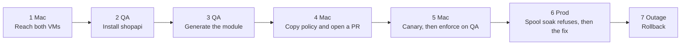
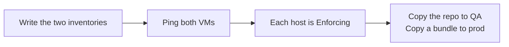
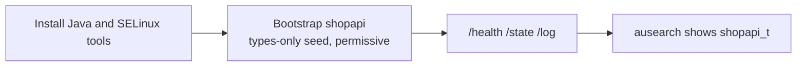
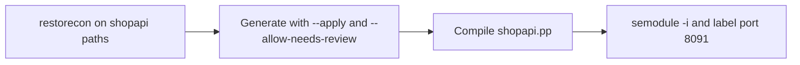
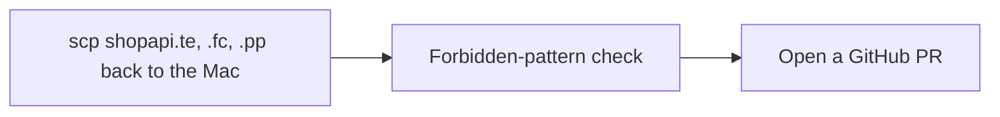
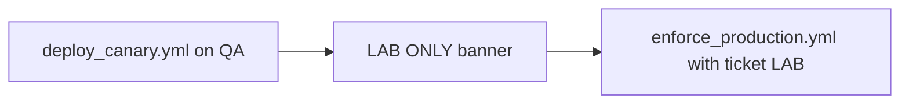
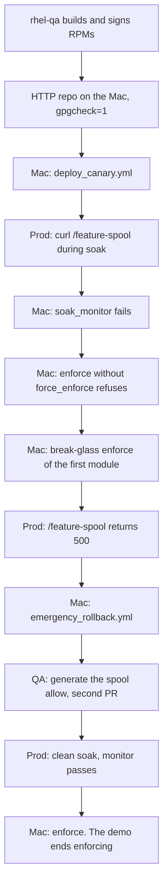

# 302 — Two Linux VMs (generate / canary / soak)

This is the meeting after [301](301-CUSTOMER.md). 301 is one host and about 20 minutes. This one is about 45 minutes and uses three windows. Do not open it for someone who has not seen 301. Commands were taught in [102](../training/102-COMMANDS.md) and [104](../training/104-HAND-BUILT-MODULE.md). The scripts are [201](../tool/201-TOOL-COMMANDS.md).

**LAST_VERIFIED:** 2026-09-18 — live Mac + rhel-qa (`$QA_HOST`) + rhel-prod (`$PROD_HOST`). The host stayed Enforcing the whole way.

The app is Spring Boot **shopapi**. The Mac does not run SELinux. It drives two RHEL VMs over SSH.



The Mac script is the conductor. It prints when to switch windows. Parts 2 and 3 are the QA window, so the Mac banner jumps from **Part 1** to **Part 4**. That skip is expected.

Press Enter when a window says `Press Enter`. Look at the prompt before you paste.

| Window | Prompt you must see | Start |
|--------|---------------------|--------|
| **Mac** | `$USER@… selinux-pac %` | `cd` to this repo, then `bash scripts/demo_e2e_mac.sh` |
| **QA** | `[ansible@rhel-qa ~]$` | `ssh $SSH_USER@$QA_HOST` |
| **Prod** | `[ansible@rhel-prod ~]$` | `ssh $SSH_USER@$PROD_HOST` |

`$QA_HOST` and `$PROD_HOST` are the addresses in the inventory this laptop uses. If `ping` fails after a VM was recreated, put the new addresses in those variables. If the prompt already says `rhel-qa` or `rhel-prod`, you are on that VM. Do not `ssh` again.

A second run on the same VMs starts on the **Mac**:

```bash
bash scripts/reset_demo_vms.sh
```

That unloads leftover shopapi modules and prod RPMs, puts the types-only seed back, and writes `/var/lib/selinux-pac-demo/ausearch-since`. It does not stop `auditd` or change `/var/log/audit`. Later `ausearch -ts` starts at that timestamp. It does not remove Java.

To read the narration on a laptop without the VMs: `bash scripts/demo_e2e_mac.sh --dry-run`.

## Part 1 — Mac: can you reach both VMs?

No SELinux command. The Mac has no `getenforce`.



Say: this laptop is the remote control. QA is where we discover denials. Prod never gets a git clone.

```bash
bash scripts/setup_rhel_hosts.sh write --qa-host "$QA_HOST" --prod-host "$PROD_HOST" --user "$SSH_USER"
bash scripts/setup_rhel_hosts.sh ping
bash scripts/setup_rhel_hosts.sh doctor
```

`write` creates the two inventory files the later playbooks use. They name shopapi, the policy package, and the manifest. `ping` prints `SUCCESS` and `pong` for both VMs. `doctor` prints `Enforcing` and the paths to `ausearch` and `sesearch`.

```bash
bash scripts/sync_rhel_dev.sh
```

`sync_rhel_dev.sh` copies this checkout onto QA at `~/selinux-pac`. The script then `scp`s a small bundle to prod at `~/e2e-demo`. Prod still has no clone of the repo.

`bash scripts/setup_rhel_hosts.sh bootstrap` installs the packages the later steps need. When it finishes, switch to the QA window.

## Part 2 — QA: install shopapi and collect denials

Replaces [104 prep](../training/104-HAND-BUILT-MODULE.md#prep) via [demo_bootstrap.sh](../tool/201-TOOL-COMMANDS.md#scriptsdemo_bootstrapsh). Denials: [ausearch](../training/102-COMMANDS.md#ausearch--m-avc).

The Mac tells you to run:

```bash
bash ~/selinux-pac/scripts/demo_e2e_rhel_qa.sh --part app
```



`--shopapi-only` installs the service, the wrapper at `/opt/shopapi/bin/shopapi`, and the types-only seed. It does not copy a JDK and it does not set `SELinuxContext=`. `shopapi_t` is permissive: denials are logged and the requests still succeed. `getenforce` stays `Enforcing`. `ps -o label,args -C java` shows `shopapi_t`. Live commands are in [LIVE_CHECKS.md](../LIVE_CHECKS.md).

Curl only `/health`, `/state`, and `/log`. Do not open `/feature-spool` here. That URL is the outage on prod, later.

A good end: the process label is `shopapi_t`, and `ausearch` shows `shopapi_t` lines. Go back to the Mac. It copies the JAR QA just built onto prod, so prod does not need Maven.

## Part 3 — QA: turn those denials into a module

Replaces [104 lab 3](../training/104-HAND-BUILT-MODULE.md#lab-3--write-the-allow-and-load-it) via [dev_generate_policy.sh](../tool/201-TOOL-COMMANDS.md#scriptsdev_generate_policysh) and [semodule -i](../training/102-COMMANDS.md#semodule--i) on the QA host.

Still on QA, when the Mac says so:

```bash
bash ~/selinux-pac/scripts/demo_e2e_rhel_qa.sh --part generate
```



`restorecon` paints `shopapi_exec_t` onto `/opt/shopapi/bin/shopapi` and `shopapi_lib_t` onto the jar before generate reads the log. `/usr/bin/java` points to a `bin_t` file under `/usr/lib/jvm`. On RHEL 9 `java_exec_t` is an alias of `bin_t` ([`corecommands.te` on c9s](https://github.com/fedora-selinux/selinux-policy/blob/c9s/policy/modules/kernel/corecommands.te)). `--allow-needs-review` is on because this JVM log contains `execmem`. `--apply` writes the allows into `selinux/shopapi/`. The module name stays `shopapi`. The JVM execute becomes `corecmd_exec_bin(shopapi_t)`, accepted only because `config/shopapi.manifest.yml` records `selinux_exceptions.exec_bin`. An `entrypoint` denial on `bin_t` is not an allow.

Then the script compiles, loads the package with `semodule -i`, and labels TCP 8091 as `shopapi_port_t`. A good end is `Built …/shopapi.pp`. Go back to the Mac. Do not canary yet.

## Part 4 — Mac: copy the policy and open a pull request



Say: the module was written on QA. The pull request is on this laptop’s checkout. Prod still does not generate policy.

The script copies `shopapi.te`, `shopapi.fc`, `policy_version.txt`, and `shopapi.pp` from QA into `selinux/shopapi/`. `validate_forbidden_patterns.sh` reads that module. `demo_open_generated_pr.sh` opens the PR when `gh` is logged in. Do not build RPMs until that PR is merged to `main`. The next ship checks out that commit.

## Part 5 — Mac: canary, then enforce on QA

[deploy_canary.yml](../tool/201-TOOL-COMMANDS.md#ansibledeploy_canaryyml) on QA. Day 0 of a production soak installs the RPM. It does not `semodule -i`.



Say: canary loads the module and leaves only `shopapi_t` in log-only mode. The rest of the machine stays Enforcing.

```bash
ansible-playbook -i ansible/inventory.dev.yml ansible/deploy_canary.yml
```

A good playbook ends with `failed=0`.

QA’s inventory has `soak_min_days: 0` so this talk can lock the domain down immediately. The script prints a red **LAB ONLY** banner there. Production’s inventory stays at 7 days. Do not copy the zero onto prod.

```bash
ansible-playbook -i ansible/inventory.dev.yml ansible/enforce_production.yml -e change_ticket=LAB
```

After this, `getenforce` is still `Enforcing` and `shopapi_t` is no longer permissive.

## Part 6 — Prod soak refuses, then the outage and rollback

[ausearch](../training/102-COMMANDS.md#ausearch--m-avc), then [soak_monitor.yml](../tool/201-TOOL-COMMANDS.md#ansiblesoak_monitoryml). The gate fails closed when `sesearch` is missing. Enforce without `force_enforce` is [enforce_production.yml](../tool/201-TOOL-COMMANDS.md#ansibleenforce_productionyml). The production install is the RPM at priority 200, not a hand `semodule -i` at 400.



Say: prod does not clone the repo. Policy arrives as two RPMs, `selinux-policy-ops` and `shopapi-selinux`, and only after the pull request is on `main`.

On the machine that publishes, create the lab key and the local repo once. The script writes a public key and a repo file with `gpgcheck=1`. It does not print the private key.

```bash
bash scripts/lab_signing_setup.sh
```

Run that on rhel-qa. The private key stays there. rhel-qa builds and signs the RPMs. UTM does not route one VM to the other, so the conductor rsyncs `dist/lab-repo` onto the Mac and serves it there. The copy has the public key, the signed RPMs, and repodata, and not the private key. Prod curls `http://<REPO_HOST>:8765/RPM-GPG-KEY` and should print `HTTP/1.0 200 OK`. Prod's inventory points `selinux_rpm_repo_baseurl` and `selinux_rpm_gpgkey` at that URL. There is no `rpm -Uvh`.

Switch to prod:

```bash
bash ~/e2e-demo/demo_e2e_rhel_prod.sh --part rpms
```

That window does not install the policy RPM and does not restart shopapi. The JVM stays unconfined. It shows `dnf repolist` and `rpm -q gpg-pubkey`.

Back on the Mac, canary is the install. It sets `shopapi_t` permissive and only then restarts the service:

```bash
ansible-playbook -i ansible/inventory.production.yml ansible/deploy_canary.yml --limit canary
```

On prod, `--part soak` curls `/health`, `/state`, `/log`, and `/feature-spool`. The domain is permissive, so the page can still return 200. `ausearch` shows a `shopapi_t` denial for `/var/spool/shopapi`. The lines are saved in `/tmp/prod-feature-spool.avc`.

The Mac then runs `soak_monitor.yml`. It must fail. `--part soak-avc` shows `/var/lib/selinux-policy-ops/shopapi/selinux_soak_last_fail.avc`. That directory is where `soak_monitor.yml` writes the fail files. Leave them in place. A later canary writes a new marker, and daily files and fail files older than that marker do not count.

Enforce omits both flags. `skip_soak_days` skips only the day count and the daily history. `force_enforce` skips the marker, the AVC gate, net-new, the report, the day count, and the daily history, and it requires `break_glass_reason`. The playbook refuses. `shopapi_t` stays permissive.

```bash
ansible-playbook -i ansible/inventory.production.yml ansible/enforce_production.yml -e change_ticket=DEMO
```

Expected: non-zero. The refusal to show is the failed soak. Do not pass `force_enforce` to hide the denial.

## Part 7 — Outage, then the fix, then enforce

[emergency_rollback.yml](../tool/201-TOOL-COMMANDS.md#ansibleemergency_rollbackyml) is [semanage permissive -a](../training/102-COMMANDS.md#semanage-permissive). `getenforce` stays Enforcing.

This beat is before the fix. The first module is loaded and does not allow `/var/spool/shopapi`. Break-glass enforce of that module makes `/feature-spool` return 500. Roll back, then generate the allow.

```bash
ansible-playbook -i ansible/inventory.production.yml ansible/enforce_production.yml \
  -e change_ticket=DEMO \
  -e force_enforce=true \
  -e break_glass_reason='show the enforcing denial before the fix'
```

On prod:

```bash
bash ~/e2e-demo/demo_e2e_rhel_prod.sh --part fail
```

`curl -sf` exits non-zero. The page is HTTP 500. The denial is `shopapi_t` opening a `var_spool_t` file.

On the Mac:

```bash
ansible-playbook -i ansible/inventory.production.yml ansible/emergency_rollback.yml
```

That puts `shopapi_t` back in log-only mode so the app runs again. `getenforce` stays `Enforcing`. Prod `--part restore` shows `/health` and `/feature-spool` returning 200 for that reason. We still do not run `semodule -i` on prod.

The Mac copies `/tmp/prod-feature-spool.avc` to QA as `~/selinux-pac/policy_out/avc.log`. On QA, `--part generate --skip-export` writes the spool allow. Merge that PR. Recanary QA, rebuild the RPMs, and canary prod again.

On prod, `--part soak-clean` curls the same four URLs. Each returns 200, and `ausearch` shows no new `shopapi` denial since this canary. `soak_monitor.yml` passes (`failed=0`).

`soak_status.yml` only reads status. The production inventory still wants 7 clean days. This recording cannot wait. The AVC gate already passed. `skip_soak_days` skips only the day count and the daily history. The marker, the AVC gate, net-new, and the report still run.

```bash
ansible-playbook -i ansible/inventory.production.yml ansible/enforce_production.yml -e change_ticket=DEMO -e skip_soak_days=true
```

Expected: `shopapi_t` is enforcing. The demo ends enforcing.

## URLs

| When | What you curl | Why |
|------|----------------|-----|
| First prod soak | `http://127.0.0.1:8091/health`, `/state`, `/log`, `/feature-spool` | The spool write is not in the first module. Permissive still returns a page; the denial fails the monitor. |
| Clean soak after the fix | same four URLs | The spool allow is loaded. Monitor passes. |
| Outage, allow not loaded | `http://127.0.0.1:8091/feature-spool` | Enforcing, and the module does not allow `/var/spool/shopapi/feature.log`. |

The port is `http.port` in `config/shopapi.manifest.yml`.

## Related

- Practice the commands first: [104-HAND-BUILT-MODULE.md](../training/104-HAND-BUILT-MODULE.md)
- The 20-minute customer talk: [301-CUSTOMER.md](301-CUSTOMER.md)
- Ansible jobs after this talk: [401-OPERATIONS.md](../admin/401-OPERATIONS.md)
- What to do when a denial shows up after ship: [401-OPERATIONS.md](../admin/401-OPERATIONS.md#a-denial-after-ship)
