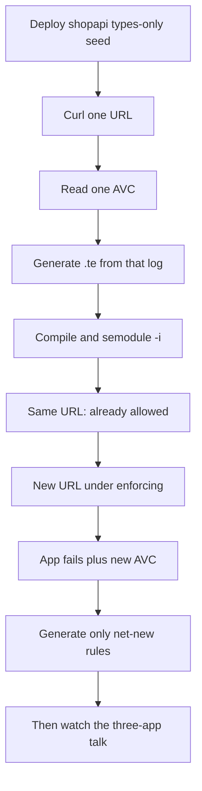

# 101 — SELinux 101 (commands before the demo)

Finish this guide **before** the three-app talk (**[202](202-DEMO_GUIDE.md)**). Words and labels are **[102](102-SELINUX_BASICS.md)** (skim §1–4 in lab 0). The talk is short because it assumes you can already: read a label, decode one AVC, generate a module from that log, load it, see that the **same** denial is not added again, then watch a **new** URL fail under enforcing and fix only the net-new rule.

This page is that practice. One app (**shopapi**), one RHEL box, typed commands. It is not the customer talk and not the two-host AAP pipeline.



| | |
|--|--|
| **Who** | Little or no SELinux. You will watch App A / App B / shopapi afterward. |
| **Where** | One RHEL host with SELinux (**rhel-qa**). macOS has no `ausearch` / `semodule`. |
| **Time** | About **60–90 minutes** on RHEL. Laptop appendix: about **20 minutes**, no kernel. |
| **App** | Spring Boot **shopapi** — the same JVM as the talk. |

**Hard rule:** before the first generate, curl **only** the URL the lab names. **`/feature-spool` is lab 5.** If you already ran the full demo, restore the types-only seed first (prep below).

**Prod vs this 101:** production ships a signed RPM and Ansible — not `semodule -i` on the box. Here you load the module on QA so you can *see* it take effect. Do not copy that install habit onto prod. Do not `setenforce 0`. Do not pipe `audit2allow` into `semodule`.

---

## Prep (once)

SSH to the SELinux host. Repo root = directory with `Makefile` and `scripts/`.

```bash
cd ~/selinux-pac   # or your clone path
```

Pick **one** way to stand shopapi up. Both end in the same place: the app listens on port **8091**, the process label is `shopapi_t`, the host stays **Enforcing**, and only that domain is log-only (labs 1–4). Words for each command are in **[102](102-SELINUX_BASICS.md)**.

### One command

`scripts/demo_bootstrap.sh --shopapi-only` runs every step below. `--shopapi-only` skips Tomcat.

```bash
sudo bash scripts/demo_bootstrap.sh --shopapi-only
```

### The same work, one command at a time

Use this when you want to see each step. Skip it if you already ran the one command above.

**1. Install the tools.** Maven builds the app. Java runs it. `python3-pyyaml` lets Python read `config/shopapi.manifest.yml` (`import yaml`). Without it, bootstrap and the generator stop at that import. `selinux-policy-devel` is the policy compiler. It supplies `/usr/share/selinux/devel/Makefile`, which turns `shopapi.te` and `shopapi.fc` into `shopapi.pp`. The Mac does not have this package.

```bash
sudo dnf install -y maven java-17-openjdk-devel python3 python3-pyyaml selinux-policy-devel
```

**2. Create the Unix account the service will run as.** This is a Linux user and group. It is not the SELinux user `system_u`, and it is not the type `shopapi_t`.

`groupadd --system shopapi` creates a system group (a low group id, for a service, not a person). `useradd` then creates the user in that group. `--home-dir /opt/shopapi` sets the home directory to the install tree. `--shell /sbin/nologin` refuses an interactive login. systemd can still start the service as this user. Files are later owned `shopapi:shopapi`, so the service can read them and your `ansible` login is not the owner.

```bash
sudo groupadd --system shopapi
sudo useradd --system --gid shopapi --home-dir /opt/shopapi --shell /sbin/nologin shopapi
```

If the account already exists, `groupadd` / `useradd` print "already exists". Continue.

**3. Create the directories.** `mkdir -p` creates them and does not fail if they already exist. They have to exist before `chown` and `restorecon`. The unit's `StateDirectory`, `LogsDirectory`, and `RuntimeDirectory` also create three of them when the service starts. `/opt/shopapi` and `/var/spool/shopapi` are not created that way.

```bash
sudo mkdir -p /opt/shopapi /var/lib/shopapi /var/log/shopapi /run/shopapi /var/spool/shopapi
```

| Path | What it holds |
|------|----------------|
| `/opt/shopapi` | The program |
| `/var/lib/shopapi` | State kept across reboots |
| `/var/log/shopapi` | Logs |
| `/run/shopapi` | Pid file. Gone after reboot. |
| `/var/spool/shopapi` | Lab 5's path. Left out of the first policy on purpose. |

**4. Build the app and copy the jar.**

```bash
cd ~/selinux-pac/demo/shopapi
sudo mvn -q -DskipTests package
sudo cp -f target/shopapi.jar /opt/shopapi/shopapi.jar
sudo chown -R shopapi:shopapi /opt/shopapi /var/lib/shopapi /var/log/shopapi /var/spool/shopapi
cd ~/selinux-pac
```

**5. Give shopapi its own `java`, and tell systemd the process label.** `/usr/bin/java` is a shared binary, type `bin_t`. A confined `shopapi_t` process is not allowed to execute it. Copying Java under `/opt/shopapi` lets that copy be labeled `shopapi_exec_t`.

```bash
java_bin=$(readlink -f /usr/bin/java)
java_home=$(cd "$(dirname "$java_bin")/.." && pwd)
sudo mkdir -p /opt/shopapi/bin /opt/shopapi/lib /opt/shopapi/conf
sudo cp -f "$java_bin" /opt/shopapi/bin/java
sudo chmod 0755 /opt/shopapi/bin/java
sudo cp -a "$java_home/lib/." /opt/shopapi/lib/
sudo cp -a "$java_home/conf/." /opt/shopapi/conf/
sudo chown -R shopapi:shopapi /opt/shopapi
```

`/etc/shopapi.env` is the port and the directories the Java process reads (`SHOPAPI_PORT`, `SHOPAPI_LOG_DIR`, and the rest). `/etc/systemd/system/shopapi.service` is how the machine starts shopapi after a reboot.

`SELinuxContext=system_u:system_r:shopapi_t:s0` is the whole label pinned on the process at start. systemd requires all four fields. `system_u` means a system object. `system_r` means a process (`object_r` would mean a file). `shopapi_t` is the type `allow` rules use. `s0` is the default level. The letters after `_` are part of the name (`_u` user, `_r` role, `_t` type). They are not a switch you can replace with another letter. The line is required because `java` is a shared binary. Without it the process comes up as `unconfined_service_t`, and the denials do not name shopapi.

`WantedBy=multi-user.target` is read by `systemctl enable`, not by writing the file. It hooks shopapi into a normal boot so a reboot starts it again. `systemctl start` alone would not do that.

```bash
sudo tee /etc/shopapi.env >/dev/null <<'EOF'
SHOPAPI_PORT=8091
SHOPAPI_STATE_DIR=/var/lib/shopapi
SHOPAPI_LOG_DIR=/var/log/shopapi
SHOPAPI_SPOOL_DIR=/var/spool/shopapi
EOF

sudo tee /etc/systemd/system/shopapi.service >/dev/null <<'EOF'
[Unit]
Description=shopapi Spring Boot (SELinux PaC demo)
After=network.target auditd.service
Wants=auditd.service

[Service]
Type=simple
User=shopapi
Group=shopapi
EnvironmentFile=-/etc/shopapi.env
WorkingDirectory=/opt/shopapi
Environment=JAVA_HOME=/opt/shopapi
SELinuxContext=system_u:system_r:shopapi_t:s0
ExecStart=/opt/shopapi/bin/java -jar /opt/shopapi/shopapi.jar
Restart=on-failure
RestartSec=5
StateDirectory=shopapi
LogsDirectory=shopapi
RuntimeDirectory=shopapi

[Install]
WantedBy=multi-user.target
EOF
```

**6. Compile the types-only seed and load it.** The `.te` declares the type names. It has almost no `allow` lines yet. You do not write this file in the lab. It is already in git. A new app with no module yet uses `scaffold_sepolicy_module.sh` (Lab 1). Shopapi's file is already there, so that script will not replace it.

`compile_and_validate.sh` reads `shopapi.te` and `shopapi.fc` because `POLICY_MODULE=shopapi`. The default name is `myapp`, and `selinux/shopapi/myapp.te` does not exist. `SELINUX_DOMAIN=shopapi_t` makes the check fail if that type name is missing from the `.te`. The script rejects dangerous allows, then writes `shopapi.pp`. The kernel does not read the `.te`.

`semodule -i` loads that `.pp`. `-i` installs or replaces the module named `shopapi`. It prints nothing on success. It does not relabel files, and it does not assign port 8091. Check with `sudo semodule -l | grep shopapi`.

```bash
sudo env POLICY_MODULE=shopapi SELINUX_DOMAIN=shopapi_t \
  bash scripts/compile_and_validate.sh selinux/shopapi
sudo semodule -i selinux/shopapi/shopapi.pp
```

**7. Paint those labels onto the files already on disk.** Look first. `ls -Z` reads the label stored on the file. `matchpathcon` does not open the file. It looks up the path in the loaded address book and prints the type the policy wants. When the two types differ, `restorecon` is what copies the policy's answer onto the file.

```bash
ls -Z /opt/shopapi /var/lib/shopapi /var/log/shopapi /run/shopapi
matchpathcon /opt/shopapi /var/lib/shopapi /var/log/shopapi /run/shopapi
```

Before `restorecon`, expect `usr_t` or `bin_t` on `/opt/shopapi` (the copied `java` is still wearing the shared-binary type), `var_lib_t` under `/var/lib/shopapi`, and `var_log_t` under `/var/log/shopapi`. `matchpathcon` should already say `shopapi_exec_t`, `shopapi_var_lib_t`, and `shopapi_log_t`. `/run/shopapi` may not exist yet (`RuntimeDirectory` creates it when the service starts). `ls` then says "No such file or directory", and `matchpathcon` can print `var_run_t`, the type of `/run` itself, because the directory is absent.

```bash
sudo restorecon -Rv /opt/shopapi /var/lib/shopapi /var/log/shopapi /run/shopapi
```

`-R` walks directories. `-v` prints only paths whose label changed. A `Relabeled` line for `/opt/shopapi/bin/java` should go from `bin_t` to `shopapi_exec_t`. This command cannot relabel `/run/shopapi` until that directory exists, and it does not touch `/var/spool/shopapi`. That path is lab 6.

**8. Label port 8091, and put only `shopapi_t` on the log-only list.** Loading `shopapi.pp` created the type `shopapi_port_t`. It did not attach that type to TCP 8091. `semanage port -a` writes that assignment. `-t` is the type, `-p tcp` is the protocol. Check first with `sudo semanage port -l | grep 8091`. If the port is already listed, skip `-a`.

`semanage permissive -a shopapi_t` adds only this process type to the log-only list. A missing allow still writes an AVC, and the action still succeeds (`permissive=1` on the line). `getenforce` stays `Enforcing`. This is not `setenforce 0`. Lab 5 removes the domain with `-d`.

```bash
sudo semanage port -a -t shopapi_port_t -p tcp 8091
sudo semanage permissive -a shopapi_t
```

If the port is already labeled, `semanage port -a` says it is defined. Continue with:

```bash
sudo semanage port -m -t shopapi_port_t -p tcp 8091
```

**9. Start the service.** `daemon-reload` makes systemd read the new unit file. Writing `/etc/systemd/system/shopapi.service` updates the disk. systemd keeps the previous copy in memory until this reload. The reload does not start the service. `enable --now` starts it now and, because of `WantedBy=multi-user.target`, starts it again on the next boot. A line of JSON from `curl` means it is up.

```bash
sudo systemctl daemon-reload
sudo systemctl enable --now shopapi.service
curl -sf http://127.0.0.1:8091/health; echo
```

Already generated on this box? Put the types-only seed back, then either run the one command again or repeat steps 6–9:

```bash
git checkout -- selinux/shopapi/
sudo bash scripts/demo_bootstrap.sh --shopapi-only
```

Need two VMs from a Mac first? [203-RHEL_TWO_HOST.md](../admin/203-RHEL_TWO_HOST.md). Run every command in this 101 **on rhel-qa**, not in macOS Terminal.

---

## Lab 0 — Words (about 10 minutes)

**Why:** every later lab is “this **type** tried to do **this permission** to **that type**.” If the third field of a label is fuzzy, the AVC will look like noise.

**Read:** **[102](102-SELINUX_BASICS.md)** §1–4 (labels, the four-part context, `ls -Z` vs `ps -eZ`).

Type the three commands one at a time, or paste the block. Each one answers a different question.

`getenforce` prints one word: the mode for the **whole machine**. You want `Enforcing`.

```bash
getenforce
```

`ls -Z` lists files and adds the SELinux label (`-Z`). `| head` keeps only the first lines of a long listing.

```bash
ls -Z /opt/shopapi | head
```

`ps -e` lists every process. `-Z` adds the label. `| grep shopapi` keeps the line that mentions shopapi.

```bash
ps -eZ | grep shopapi
```

**Good sign**

| Command | Shape of a good answer |
|---------|------------------------|
| `getenforce` | `Enforcing` — we never turn the host off |
| `ls -Z` | A line with `system_u:object_r:`**`shopapi_exec_t`**`:s0` (file **type**, third field) |
| `ps -eZ` | A java line with `system_u:system_r:`**`shopapi_t`**`:s0` (process **domain**) |

**Checkpoint:** What is the difference between the type on the **file** and the type on the **running process**?

The file type and the process type are supposed to differ. On a good run, `ls -Z /opt/shopapi` shows `shopapi_exec_t` (the sign on the program files, including `bin/java` and `shopapi.jar`). `ps -eZ | grep shopapi` shows `shopapi_t` (the badge on the running Java process). An `allow` rule names both: may a process badged `shopapi_t` use a file signed `shopapi_exec_t`? Starting the program does not change the file's type into `shopapi_t`. `restorecon` labeled the files. `SELinuxContext` in the unit labeled the process. `getenforce` still prints `Enforcing`. The log-only list does not change either type.

---

## Lab 1 — Deploy (the seed is not a permission list)

**Why:** the talk will say “types-only seed, then allows come from AVCs.” You should have seen that file with your own eyes.

Type these one at a time, or paste the block.

`systemctl status` asks systemd whether the service is running. `--no-pager` prints the answer and returns, instead of opening a viewer you have to quit.

```bash
systemctl status shopapi --no-pager
```

`ps -C java` selects processes named `java`. `-o label=,args=` prints only the SELinux label and the command line. The `=` drops the column title. `| head` keeps the first lines.

```bash
ps -o label=,args= -C java | head
```

`sed -n '1,32p'` prints lines 1 through 32 of the rule book and then stops. You are checking that the seed names the types and has almost no `allow` lines. `cat` prints the whole file.

```bash
sed -n '1,32p' selinux/shopapi/shopapi.te
```

### Where `shopapi.te` came from

This lab uses the file already in git. Read it. Leave it in place. Labs 2–6 start from this seed.

A **new** app has no `selinux/<name>/` yet. Then you create the starter once, with `scaffold_sepolicy_module.sh`. That script will not replace a `.te` that already exists. Running it for shopapi prints `Skipping ... already exists` and does nothing. Do not delete `shopapi.te` to force a new one. `sepolicy-generate` writes Red Hat's unconfined template, which is a different file from this seed.

**One command,** for a new module (the example name is `payments`, not shopapi):

```bash
sudo dnf install -y policycoreutils-devel
bash scripts/scaffold_sepolicy_module.sh payments payments_t
```

`policycoreutils-devel` supplies `sepolicy-generate`. The script's two arguments are the module name and the process type.

**What that script does, one command at a time.** Skip this on the shopapi lab. It is here so the wrapper is not a mystery.

`sepolicy-generate` writes a starter in a temporary directory. `-a payments_t` is the domain to create. `-t unconfined_t` is the Red Hat template it starts from.

```bash
sepolicy-generate -a payments_t -t unconfined_t
```

The script then copies `payments.te`, `payments.if`, and `payments.fc` into `selinux/payments/` only when those files are missing. `.te` is the rule book. `.fc` is the address book. `.if` is a list of helpers other modules can call. The copy still has no allows from a real denial. Those come from `dev_generate_policy.sh` after the app has run.

Shopapi's committed seed is that same kind of starter, trimmed so you can see the type names and the absence of a `/log` allow. The address book that goes with it is `selinux/shopapi/shopapi.fc`.

**Good sign**

- Unit is **active**.
- Process label is **`shopapi_t`** (after the seed is loaded). If you still see `unconfined_service_t` / `unconfined_java_t`, the seed did not load — re-run bootstrap.
- [`selinux/shopapi/shopapi.te`](../../selinux/shopapi/shopapi.te) declares types (`shopapi_t`, `shopapi_log_t`, …) and `init_daemon_domain(...)`. It does **not** yet list first-ship `allow` lines for `/log` or `/var/spool`.

**Checkpoint:** If the `.te` has almost no `allow` lines, how can the app still answer HTTP while `shopapi_t` is **permissive**? (Denials are **logged**; the kernel does not block that domain.)

---

## Lab 2 — One test, one AVC

**Why:** the demo flashes `ausearch` and moves on. You need to read **one** line slowly.

Curl **`/log` only.** Leave `/health`, `/state`, and `/feature-spool` for later labs.

`curl` is the client. `-s` hides the progress meter. `-f` makes an HTTP error a failed command. `8091` is shopapi. `echo` prints a blank line so the next output is easy to see.

```bash
curl -sf http://127.0.0.1:8091/log
echo
```

Then read the denial. One pipeline, or the same stages one at a time.

```bash
sudo ausearch -m avc -ts recent | grep shopapi_t | tail -n 20
```

| Piece | What it does |
|-------|----------------|
| `sudo` | The audit log is not readable by a normal login. |
| `ausearch` | Search that log. |
| `-m avc` | Only denial messages. |
| `-ts recent` | The last ten minutes. |
| `\| grep shopapi_t` | Keep lines whose process type is shopapi. |
| `\| tail -n 20` | Keep the last 20 of those lines. |

The same search without the filters, if you want to see the raw log first:

```bash
sudo ausearch -m avc -ts recent
```

You may see **more than one** line (JVM startup plus the log write). Pick **one** that you can explain.

`audit2why` turns a denial into a shorter English hint. Keep the `grep shopapi_t`. `| tail -n 40` keeps the last 40 lines. Read the hint. Do not pipe `audit2allow` into `semodule`. `audit2why` will suggest that. The lab does not do it.

```bash
sudo ausearch -m avc -ts recent | grep shopapi_t | audit2why | tail -n 40
```

**If you leave out `grep shopapi_t`, shopapi disappears.** `ausearch` returns every domain from the last ten minutes, and `tail` keeps only the end of that list. On this practice VM a leftover `myapp` service often fills those lines: `comm="python"` or `backend_stub.py`, `scontext=init_t` (systemd, not shopapi), `tcontext=unlabeled_t`, and `trawcon` mentioning `myapp_exec_t`. `unlabeled_t` means the `myapp` module is not loaded, so the kernel no longer knows that type. `audit2why` then says "missing allow rule" about those lines. That is not the `/log` denial. A shopapi line has `scontext=...shopapi_t` and `comm="java"`.

If the grepped command prints nothing, the `/log` curl was more than ten minutes ago, or it has not been run yet. Curl `/log` again, then run the grepped search. Do not generate a module from the `myapp` lines.

**How to read one line** (ignore timestamps):

```text
avc:  denied  { write } for ... path="..." \
  scontext=...:shopapi_t:s0 \
  tcontext=...:var_log_t:s0 \
  tclass=file permissive=1
```

| Field | Meaning |
|-------|---------|
| `{ write }` | Permission that was not allowed |
| `scontext` … **`shopapi_t`** | Who (process domain) |
| `tcontext` … **type** | What it touched (file / port / …) |
| `tclass` | Kind of object (`file`, `dir`, `tcp_socket`, …) |
| `permissive=1` | Domain is log-only — the syscall **still succeeded** |

`permissive=0` means enforcing: the syscall **failed**. You should not see `0` until lab 5.

**Checkpoint:** In your chosen line, who is the process type, what is the target type, and what permission was missing?

---

## Lab 3 — Add the missing allows and load them

**Why:** the seed already exists. This lab adds the missing `allow` lines to that same module. It does not create a second policy.

`selinux/shopapi/shopapi.te` and `shopapi.fc` are already on disk. They name `shopapi_t`, `shopapi_log_t`, and the other types. They do not yet allow the `/log` write from lab 2. The generator reads those files, compares them with the denial log, and writes an updated copy. An access the `.te` already allows is marked `baseline` and is not written again. An access that is missing becomes a new line. `--apply` copies that result back onto the same two paths, so the module name stays `shopapi`. Typing an `allow` by hand would edit the same file. The generator chooses the line from the denial you just read. Lab 4 checks that `/log` works with this module loaded. It does not run the generator a second time.

`semodule -i` afterward replaces the loaded `shopapi` module in place. `-i` on a module that is already installed is an upgrade.

From the repo root. Pick **one** way to generate. Both update the same files when you pass the same flags. The talk declines the generator twice (App A covered, App B tuned) before this step. Shopapi has no vendor module, so the pre-flight lets it through.

### One command

```bash
sudo bash scripts/dev_generate_policy.sh --apply --app-name shopapi --app-root "$(pwd)"
```

| Piece | What it does |
|-------|----------------|
| `sudo` | Reading the audit log needs root. `policy_out/` may end up owned by root. |
| `--app-name shopapi` | Module and domain. The default name is `myapp`, the laptop sample. |
| `--app-root "$(pwd)"` | This directory. `"$(pwd)"` is the current directory as one argument. |
| `--apply` | After generation, copy `policy_out/shopapi.te` and `.fc` into `selinux/shopapi/`. |

That one command hides six steps. The section below types each one. Use the one command, or type the steps. Do not do both for the same generate.

1. Check that no vendor module already confines this app.
2. Copy this app's denials into `policy_out/avc.log`.
3. Run `cli/deterministic_gen.py`, which writes `policy_out/shopapi.te`, `.fc`, and `findings.json`.
4. Run `validate_forbidden_patterns.sh` on that output.
5. Compile `policy_out/` to a `.pp`.
6. With `--apply`, copy the `.te` and `.fc` into `selinux/shopapi/`.

On this lab the one command stops before step 6. That stop is expected. The screen looks like this:

```text
[INFO] vendor policy check: no vendor or base module covers 'shopapi'; continuing
[INFO] Exported 8991 AVC lines to .../policy_out/avc.log
*** GENERATION BLOCKED — domain-weakening permission requires --allow-needs-review ***
NEEDS REVIEW: ... process:execmem ...
Wrote .../policy_out/findings.json (generation_blocked=true)
```

Read it in three parts:

- The vendor line means Red Hat does not already confine this app, so generation was allowed to start.
- `8991 AVC lines` is the same denial written many times. Permissive mode logs every attempt. It is not 8991 different rules.
- `GENERATION BLOCKED` means Java asked for `execmem`: memory that is both writable and executable. The tool recorded that in `findings.json` and refused to put it in the `.te`. `shopapi.te` and `shopapi.fc` are still the seed. `--apply` did not copy anything.

For this 101 only, run the same command with one more flag. `--allow-needs-review` writes that permission because it was in the log. Do not type `execmem` into the `.te` yourself if it was not in the log.

```bash
sudo bash scripts/dev_generate_policy.sh --apply --app-name shopapi --app-root "$(pwd)" --allow-needs-review
```

That second run can still fail at the compiler, after `Forbidden-pattern checks passed`. The error names this line:

```text
allow shopapi_t bin_t:file { entrypoint };
```

`entrypoint` means this file type may be the program that enters `shopapi_t`. The seed already allows that for `shopapi_exec_t`. The denial is from before `restorecon`, when `/opt/shopapi/bin/java` was still `bin_t`, the type a copied `/usr/bin/java` keeps. The audit line has `path="/opt/shopapi/bin/java"` and `tcontext=...:bin_t:s0`. `permissive=0` and a new pid every few seconds is systemd retrying that start. The forbidden-pattern check looks for `bin_t:file execute`, so `entrypoint` gets through. The compiler then says `unknown type bin_t` because this module never declares that type. The `insights_core.if` lines above the error are duplicate-definition warnings from the RHEL policy package.

Check the file now:

```bash
ls -Z /opt/shopapi/bin/java
```

`shopapi_exec_t` means the label is already correct and those audit lines are old. Leave them out of the log and generate again. `--skip-export` reads the file you pass and does not reread the audit log. `--allow-needs-review` is still required, because `execmem` is still in the kept lines.

```bash
grep -v 'denied  { entrypoint } for .* path="/opt/shopapi/bin/java".*object_r:bin_t' policy_out/avc.log > /tmp/shopapi-avc.log
sudo bash scripts/dev_generate_policy.sh --apply --allow-needs-review --skip-export --avc-log /tmp/shopapi-avc.log --app-name shopapi --app-root "$(pwd)"
```

A good run prints `14 net-new denial(s)` (the `bin_t` line is the one you removed), `Built .../policy_out/shopapi.pp`, `AVC coverage OK`, and `Updated .../selinux/shopapi/shopapi.te`. The version in the diff goes from `1.0.0` to `1.0.1`. `allow shopapi_t shopapi_log_t:file open` is the `/log` denial. `allow shopapi_t self:process execmem` is the review permission.

The script then prints `Next steps (Git PR handoff)` and may warn `no selinux/shopapi.te at merge-base`. That block is the pull-request helper. It looks for `selinux/shopapi.te` at the repository root. This lab's file is `selinux/shopapi/shopapi.te`. Do not commit, push, or run `gh pr create`. The next commands are step 6. They compile the copy `--apply` just wrote and load it.

`semodule -i` prints nothing when the install works. `semodule -l | grep shopapi` prints two names. `shopapi` is the module you installed. `permissive_shopapi_t` is the log-only switch from prep. `restorecon` prints no `Relabeled` lines when the files already have the types in the address book.

### The same work, one command at a time

Skip this if you already ran the one command.

**1. Vendor check.** The generator refuses to write a module when Red Hat already ships the domain (Tomcat, httpd, and similar). Shopapi has no such module, so this check continues. `semodule -l` lists loaded modules. `grep` looks for names that would stop generation.

```bash
sudo semodule -l | grep -E 'tomcat|httpd|shopapi' || true
```

You should see `shopapi` only if prep already loaded the seed. You should not see a vendor module that means "shopapi is already confined by Red Hat."

**2. Save this app's denials.** `--input-logs` reads the audit log files. `--subject shopapi_t` keeps that process type. `--format raw` is the form the generator reads. `-ts boot` means since boot. `tee` writes the lines into `policy_out/avc.log`.

```bash
sudo mkdir -p policy_out
sudo ausearch --input-logs -m AVC,USER_AVC -ts boot --subject shopapi_t --format raw | sudo tee policy_out/avc.log >/dev/null
```

The one command then drops lines that are outside this app's directories. The file you just wrote is the full `shopapi_t` log. Open it if you want to see the input. For the same module the later labs expect, prefer the one command, because of that extra filter.

**3. Turn that log into a rule book.** `deterministic_gen.py` compares the log with the `.te` and `.fc` you already have. It writes `policy_out/`. It does not edit `selinux/` yet.

```bash
cp selinux/shopapi/policy_version.txt policy_out/policy_version.txt
python3 cli/deterministic_gen.py \
  --avc-log policy_out/avc.log \
  --manifest config/shopapi.manifest.yml \
  --existing-te selinux/shopapi/shopapi.te \
  --existing-fc selinux/shopapi/shopapi.fc \
  --out-dir policy_out \
  --version-file policy_out/policy_version.txt \
  --bump-version
```

| Flag | What it is |
|------|------------|
| `--avc-log` | The denial file from step 2. |
| `--manifest` | Paths and port from `config/shopapi.manifest.yml`. |
| `--existing-te` / `--existing-fc` | The seed already on disk. Lines it already allows are marked `baseline`. |
| `--out-dir` | Where the new `.te`, `.fc`, and `findings.json` go. |
| `--bump-version` | Advances the version number stored next to the module. |

Add `--allow-needs-review` on that command only when it exits 1 and names `execmem`.

**4. Reject dangerous allows before you compile.** `validate_forbidden_patterns.sh` reads the `.te` and `.fc` and exits 1 if a rule is one this repo will not ship. `compile_and_validate.sh` runs this same script first. Run it by itself so a failure is about the rules, not the compiler.

```bash
POLICY_MODULE=shopapi SELINUX_DOMAIN=shopapi_t \
  bash scripts/validate_forbidden_patterns.sh policy_out
```

| It checks | Why |
|-----------|-----|
| No `allow` with a `*` wildcard | A wildcard permits every type or every class. |
| No `bin_t:file execute` | That would let the app run every system binary. App programs get their own `*_exec_t`. |
| No allow of `shadow_t`, `unconfined_t`, or `sysadm_t` | Those are high-privilege types. |
| The file contains `policy_module(...)` | That is the module header. |
| The file mentions `shopapi_t` | `SELINUX_DOMAIN` must appear in the `.te`. |
| The `.fc` mentions `/opt/shopapi`, `/var/lib/shopapi`, `shopapi_exec_t`, and `shopapi_var_lib_t` | The address book has to cover the install path and the state path. |

A good last line is `Forbidden-pattern checks passed for shopapi`.

**5. Copy the new rule book and address book into the directory you commit.** This is what `--apply` does.

```bash
sudo cp policy_out/shopapi.te selinux/shopapi/shopapi.te
sudo cp policy_out/shopapi.fc selinux/shopapi/shopapi.fc
sudo cp policy_out/policy_version.txt selinux/shopapi/policy_version.txt
```

**Look at the result** either way. `python3 -m json.tool` pretty-prints the verdicts. `| head -n 80` keeps the first 80 lines. `tail -n 40` prints the last 40 lines of the generated rule book.

```bash
python3 -m json.tool policy_out/findings.json | head -n 80
tail -n 40 policy_out/shopapi.te
```

**6. Compile and load.** `compile_and_validate.sh` runs step 4 again on `selinux/shopapi`, then calls the policy compiler from `selinux-policy-devel` and writes `shopapi.pp`. `semodule -i` loads that package. `restorecon` paints the new labels onto existing files. `semodule -l | grep shopapi` confirms the name is loaded.

```bash
POLICY_MODULE=shopapi SELINUX_DOMAIN=shopapi_t \
  bash scripts/compile_and_validate.sh selinux/shopapi
sudo semodule -i selinux/shopapi/shopapi.pp
sudo restorecon -Rv /opt/shopapi /var/lib/shopapi /var/log/shopapi
sudo semodule -l | grep shopapi
```

**Good sign:** `compile_and_validate` prints `Built …/shopapi.pp`. `semodule -l` lists both `shopapi` and `permissive_shopapi_t`. `findings.json` rows have verdicts (`direct`, `interface`, `fc_fix`, …) — not a dump of raw `audit2allow`.

**Checkpoint:** Where do the new `allow` lines come from — a JVM cookbook, or the AVC log you just exported?

---

## Lab 4 — Same test, no new rule

**Why:** the loaded module should allow the access you already generated. A new denial for that same access means the rule did not land.

`curl -sf` calls `/log` again. `echo` prints a blank line. The `ausearch` pipeline is the lab 2 search, with `tail -n 5` keeping five lines instead of twenty.

```bash
curl -sf http://127.0.0.1:8091/log
echo
sudo ausearch -m avc -ts recent | grep shopapi_t | tail -n 5
```

**Good sign**

- The curl prints `LOG /var/log/shopapi/shopapi.log`.
- `ausearch` prints no `shopapi_t` lines. An allow does not produce an AVC. Permissive mode only logs access the rules still refuse.

Do not run `dev_generate_policy.sh` again in this lab. The `execmem` line already in the file is `allow shopapi_t self:process execmem;`, with no braces. The generator only treats a rule as already present when the permissions sit inside `{ }`, and it records the target word `self` separately from the type `shopapi_t`. A second run therefore stops on `execmem` again. Adding `--allow-needs-review` this time would append a second copy of that line. The blocked run does not change `selinux/shopapi/shopapi.te`. Leave the loaded `1.0.1` module as it is and go to lab 5.

**Checkpoint:** If curl prints the log line and `ausearch` is empty, what does that say about the `/log` allow?

---

## Lab 5 — New test fails (host stays Enforcing)

**Why:** the talk’s outage is `/feature-spool` **after** the first module is enforcing. The file is `/var/spool/shopapi/feature.log` — not in the first-ship module.

Type these one at a time, or paste the block.

`semanage permissive -d shopapi_t` takes shopapi off the log-only list. The rest of the machine was already Enforcing.

```bash
sudo semanage permissive -d shopapi_t
```

`semanage permissive -l` lists who is still log-only. `| grep shopapi` looks for this domain. `|| echo ...` runs only when grep finds nothing, and prints the confirmation.

```bash
sudo semanage permissive -l | grep shopapi || echo "(shopapi_t not on the permissive list — good)"
```

`curl -sf` fails on an HTTP error, which is what you want to see. `echo "exit=$?"` prints that command's exit code. `$?` is the exit code of the command just before it. A non-zero number means the request failed.

```bash
curl -sf http://127.0.0.1:8091/feature-spool; echo "exit=$?"
```

`curl -sS` is silent but still prints an error. There is no `-f`, so you can see the response body. `|| true` keeps the shell going when curl fails.

```bash
curl -sS http://127.0.0.1:8091/feature-spool || true
```

The search is lab 2's search. `tail -n 15` keeps the last 15 lines. You want `permissive=0` on the spool denial.

```bash
sudo ausearch -m avc -ts recent | grep shopapi_t | tail -n 15
```

**Good sign**

- `curl -sf` is **non-zero** (often HTTP 500). The app is confined, not “SELinux is off.”
- AVC lines show **`permissive=0`**.
- `getenforce` is still **`Enforcing`**. You did **not** run `setenforce 0`.

**Checkpoint:** Why did `/log` still work and `/feature-spool` fail? (First module covers the first URL. The spool path was never in that module.)

---

## Lab 6 — Update policy (only the new surface)

**Why:** a second generate should add **`/var/spool/shopapi`** (label + allow), not replay lab 3.

The lab 5 denials are new, so `/tmp/shopapi-avc.log` from lab 3 does not contain them. Export again, then drop the old `bin_t` entrypoint lines the same way as lab 3. Those lines are still in the audit log. `--allow-needs-review` is required because `execmem` is still in the kept lines. `--skip-export` stops the script from putting the `bin_t` lines back.

```bash
sudo bash scripts/dev_generate_policy.sh --app-name shopapi --app-root "$(pwd)" --allow-needs-review || true
grep -v 'denied  { entrypoint } for .* path="/opt/shopapi/bin/java".*object_r:bin_t' policy_out/avc.log > /tmp/shopapi-avc.log
sudo bash scripts/dev_generate_policy.sh --apply --allow-needs-review --skip-export --avc-log /tmp/shopapi-avc.log --app-name shopapi --app-root "$(pwd)"
```

The first command may exit 1 at the compiler on the `bin_t` line. `|| true` keeps the shell going so the export it already wrote can be filtered. Before `semodule -i`, look at the rule book:

```bash
grep -n execmem selinux/shopapi/shopapi.te
grep -n 'shopapi_log_t:file open' selinux/shopapi/shopapi.te
```

One match for each is the lab 3 line. A second match means the generator appended a copy of a one-permission allow it did not recognize. The new spool lines are the ones this lab adds. A repeated `execmem` or `/log` allow is the same recognition gap as lab 4.

Then compile, load, relabel, and retry. One at a time, or as this block. `restorecon` now includes `/var/spool/shopapi`, the path lab 5 wrote. `curl -sf` should print the page and exit 0. `echo` prints a blank line after it.

```bash
POLICY_MODULE=shopapi SELINUX_DOMAIN=shopapi_t \
  bash scripts/compile_and_validate.sh selinux/shopapi
sudo semodule -i selinux/shopapi/shopapi.pp
sudo restorecon -Rv /var/spool/shopapi /opt/shopapi /var/lib/shopapi /var/log/shopapi
curl -sf http://127.0.0.1:8091/feature-spool
echo
```

**Good sign**

- `/feature-spool` returns **200** under enforcing (`shopapi_t` still **not** permissive).
- The new `.te` / `.fc` rows mention the spool path or its type.
- `execmem` and `shopapi_log_t:file open` each appear once. A second copy is the lab 4 recognition gap, not a new spool rule.

**Checkpoint:** What is the difference between “there were AVCs in the log” and “net-new access the `.te` does not already allow”?

You can put the domain back in permissive if you will keep using this VM as a discovery box:

```bash
sudo semanage permissive -a shopapi_t
```

---

## Lab 7 — Map to the talk

You now have the skills the demo assumes. **Do not** run the full talk yet — read the table, then open **[202](202-DEMO_GUIDE.md)**.

| Talk act | What they will show | What you already practiced |
|----------|---------------------|----------------------------|
| **0 Triage** | Vendor-policy check: covered vs unconfined vs generate | Lab 3: shopapi is **none** → generator runs. App A/B are not this path. |
| **1 App A** | Greenfield Tomcat, already enforcing. `getenforce`, domain, `/standard/` works, `/standard/forbidden.jsp` + `ausearch`. **No generate.** | Labs 0–2: evidence + a denial you **do not** turn into a custom `.te` when vendor policy already applies. |
| **2 App B** | Inherited Tomcat: wrong path, odd port, outbound gateway. **Zero `.te`.** | [Appendix A](#appendix-a-app-b-three-host-commands-not-a-te). |
| **3 shopapi** | Types-only seed, first-ship `/health` `/state` `/log`, generate from **observed** AVCs | Labs 1–4 (the talk curls three first-ship URLs at once; you split `/log` so one AVC was readable). |
| **4–5** (technical) | PR, canary, soak, `/feature-spool` on **prod**, rollback, recanary | Labs 5–6 on **one** QA host. Prod does **not** `semodule -i`. |

Next: **[202](202-DEMO_GUIDE.md)** (`demo_present.sh`). Two-host ship path: **[203](../admin/203-RHEL_TWO_HOST.md)**.

---

## Appendix A: App B three host commands (not a .te)

Act 2 will type **host** commands against **vendor** Tomcat (`tomcat_t` or `jws6_tomcat_t`). They never write `selinux/shopapi/`. If you generate a module for Tomcat, you duplicated Red Hat’s policy.

| Symptom | What you type | Each piece |
|---------|----------------|-----------|
| Files under `/opt/appdata` have the wrong type | `sudo semanage fcontext -a -t tomcat_var_lib_t '/opt/appdata(/.*)?'` then `sudo restorecon -Rv /opt/appdata` | `fcontext -a` adds an address-book line. `-t` is the type. `(/.*)?` means the directory and everything under it. `restorecon` paints the files. Type the two commands separately. |
| Bind on a high port (talk: **8090**) | `sudo semanage port -a -t http_port_t -p tcp 8090` | `-a` adds the port. `-t http_port_t` is the type vendor policy already allows a web server to bind. `-p tcp` is the protocol. |
| Outbound connect denied, `audit2why` names a boolean | `sudo setsebool -P tomcat_can_network_connect on` | `setsebool` flips a switch the vendor module already contains. `-P` keeps it across reboot. `on` is the value. JWS may name the switch `jws6_can_network_connect`. |

`--tune-report` on a vendor-covered app prints those same three kinds of lines into `policy_out/tune_report.md`. Still **no** `.te`.

You do **not** need App A/B installed to finish labs 0–6. This appendix is so Act 2 is not a surprise.

---

## Appendix B: Laptop (no SELinux)

This is how `make check` thinks. It does **not** replace labs 2–6.

From **repo root** on any OS. Each run is one command. The flags are the same every time. Only the log file changes.

| Flag | What it is |
|------|------------|
| `python3 cli/deterministic_gen.py` | The generator, without reading a live audit log. |
| `--explain` | Print the verdict. Do not write a module. |
| `--avc-log` | A saved denial file in the repo. |
| `--manifest` | The sample app's paths and name (`myapp`, not shopapi). |
| `--existing-te` / `--existing-fc` | The sample rule book and address book the verdict is compared with. |

**One denial, classify it** (`fc_drift` — path already in `.fc`, fix is `restorecon`):

```bash
python3 cli/deterministic_gen.py --explain \
  --avc-log docs/examples/fixtures/deterministic/01-mislabeled-var-lib/avc.log \
  --manifest config/myapp.manifest.yml \
  --existing-te selinux/myapp.te \
  --existing-fc selinux/myapp.fc
```

**Already allowed** (lab 4 analog) — fixture `05-baseline-covered`:

```bash
python3 cli/deterministic_gen.py --explain \
  --avc-log docs/examples/fixtures/deterministic/05-baseline-covered/avc.log \
  --manifest config/myapp.manifest.yml \
  --existing-te selinux/myapp.te \
  --existing-fc selinux/myapp.fc
```

Expect verdict **`baseline`** — no new `allow`.

**New labeling line** (lab 6 analog for files) — fixture `06-fc-missing-line`:

```bash
python3 cli/deterministic_gen.py --explain \
  --avc-log docs/examples/fixtures/deterministic/06-fc-missing-line/avc.log \
  --manifest config/myapp.manifest.yml \
  --existing-te selinux/myapp.te \
  --existing-fc selinux/myapp.fc
```

Expect **`fc_fix`**. Full golden suite: `make test-fixtures`. Concepts: [204-DETERMINISTIC_POLICY.md](../developers/204-DETERMINISTIC_POLICY.md). `selinux/myapp.te` is the **offline golden**, not a live app.

---

## Command cheat sheet

Each command is explained in the lab that first uses it. This list is the short form.

**Status.** `getenforce` is the one-word mode (lab 0). `sestatus` adds the name of the loaded policy. `systemctl status auditd` checks that the service writing `/var/log/audit/audit.log` is running. `--no-pager` prints and returns.

```bash
getenforce
sestatus
sudo systemctl status auditd --no-pager
```

**Labels.** `ls -Z` is the label on disk (lab 0). `ps -eZ | grep shopapi` is the process label. `matchpathcon` asks policy what the label *should* be. Compare it with `ls -Z` on the same path.

```bash
ls -Z /opt/shopapi /var/lib/shopapi /var/log/shopapi /run/shopapi
ps -eZ | grep shopapi
matchpathcon /var/log/shopapi
```

**Relabel from `.fc`.** `-R` walks directories. `-v` prints each path that changed. `-n` prints what would change and writes nothing.

```bash
sudo restorecon -Rv /opt/shopapi /var/lib/shopapi /var/log/shopapi /run/shopapi
sudo restorecon -Rv -n /var/log/shopapi
```

**Permissive domain (one app — host stays Enforcing)**

```bash
sudo semanage permissive -a shopapi_t   # labs 1–4
sudo semanage permissive -l
sudo semanage permissive -d shopapi_t   # lab 5
```

**Audit**

```bash
sudo ausearch -m avc -ts recent
sudo ausearch -m avc -ts recent | grep shopapi_t
sudo ausearch -m avc -ts recent | grep shopapi_t | audit2why
```

**Module (QA 101 only)**

```bash
sudo semodule -l | grep shopapi
POLICY_MODULE=shopapi SELINUX_DOMAIN=shopapi_t \
  bash scripts/compile_and_validate.sh selinux/shopapi
sudo semodule -i selinux/shopapi/shopapi.pp
```

**Generate**

```bash
sudo bash scripts/dev_generate_policy.sh --apply --app-name shopapi --app-root "$(pwd)"
```

**Do not**

- `setenforce 0`
- `audit2allow` piped to `semodule` on the box
- `curl …/feature-spool` before lab 5
- `semodule -i` on **prod** (Ansible / RPM — [203-RHEL_TWO_HOST.md](../admin/203-RHEL_TWO_HOST.md))
