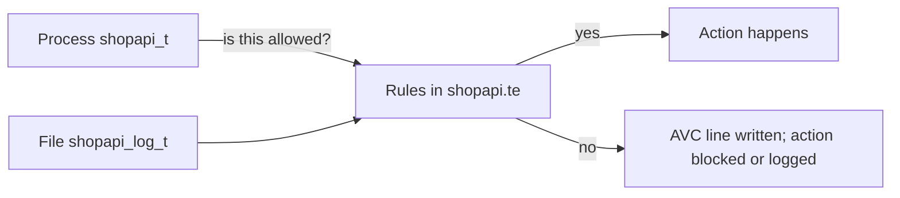

# 102 — SELinux basics

Read this before you type the labs in **[101](101-SELINUX.md)**. You do not need to have used SELinux before. Each section explains a word before it uses that word again.

Two names show up over and over. They are the same idea, on different files:

| Name | What it is |
|------|------------|
| **shopapi** | The small Java app you run on the practice machine (**rhel-qa**). Its process label is `shopapi_t`. The labs in **101** and the customer talk in **[202](../demo/202-DEMO_GUIDE.md)** use this app. |
| **myapp** | A sample policy stored in the git repo so tests can run on a laptop (`make check`). No service named myapp is running on rhel-qa. When a snippet says `myapp_t`, read it as "the same kind of label as `shopapi_t`, written against the sample." |

**How to read this**

1. **Sections 1–4** — what SELinux is, and how to read a label. This is lab 0 of **101**.
2. **Sections 5–7** — the text files that hold the rules, the command that fixes labels on disk, and why the machine stays locked while one app only writes a log.
3. **Stop here** if you are about to do the **101** labs. Come back after you have seen one denial line.
4. **Sections 7.5–12** — what production does with the same ideas: a waiting period, the denial log, and the path from that log to a reviewed change.
5. **Sections 13–16** — mistakes, a command list, and a glossary.

**Where a command runs**

| What you are doing | Where |
|--------------------|--------|
| Reading this page | Anywhere |
| `getenforce`, `ls -Z`, `ps -eZ`, `semanage` | The Linux machine that has SELinux (**rhel-qa**) |
| `make check`, reading files under `selinux/` | Your laptop, in the repo folder (the directory that contains `Makefile`) |

A Mac has no SELinux. You do not type `getenforce` or `semodule` in the Mac terminal. Appendix B of **101** shows the laptop-only version of the later labs.

---

## 1. What is SELinux?

Linux already checks file permissions. Those answer one question: "Is this Unix user allowed to read or write this file?" The owner of the file can change the answer with `chmod` (change mode) or `chown` (change owner).

**SELinux** (Security-Enhanced Linux) adds a second check inside the **kernel**, the core of the operating system. It answers a different question: "Is this *program* allowed to do this action to this *object*?" The program cannot turn that check off by changing the file's owner. An administrator ships the rules.

That style of control is called **mandatory access control**: the system enforces the rules. Ordinary Unix permissions are called **discretionary access control**: the file owner has a say.

| | Unix permissions | SELinux |
|--|------------------|---------|
| Question | Can Unix user `ansible` read this file? | Can a running program labeled `shopapi_t` write a file labeled `shopapi_log_t`? |
| Who changes the answer | The file owner, with `chmod` / `chown` | An administrator, by editing rules and installing a **module** |
| Both are checked | A file can be writable by its Unix owner and still be denied by SELinux | |

Why this exists: if an attacker takes over the app, they still only get what that app's label is allowed to touch. They do not inherit every file the Unix user can read.

On Red Hat Enterprise Linux (RHEL), Fedora, and CentOS Stream, SELinux is already turned on.

Three words you will need immediately:

| Word | Meaning |
|------|---------|
| **Policy** | The full set of SELinux rules loaded in the kernel. |
| **Module** | One app's piece of that policy. Shopapi has its own module. `sshd` and `systemd` already have modules that Red Hat shipped. |
| **Label** | The tag on a process or a file. The next section is only about labels. |

---

## 2. Labels — the core idea

Every running program and every file wears a label. When the program tries to open a file, connect to a port, or start another program, the kernel compares the two labels against the policy.

Picture a building:

| In the building | In SELinux | Shopapi |
|-----------------|------------|---------|
| Badge on a person | Label on a **running process**. When the label is on a process, people call it a **domain**. | `shopapi_t` |
| Sign on a door | Label on a **file** or directory | `shopapi_log_t` on a log file |
| Rule book at the front desk | An **allow rule** | "A process badged `shopapi_t` may write a file signed `shopapi_log_t`" |

Four facts:

- A **process** label is what you see with `ps -eZ` (list processes, and include the SELinux label).
- A **file** label is what you see with `ls -Z` (list files, and include the SELinux label).
- The kernel's question is always: "Does policy allow this **source type** to do this **action** to this **target type**?"
- If no rule allows it, two things can happen. In **Enforcing** mode the action is blocked and a line is written to the audit log. If that one domain is **permissive**, the action still happens and the line is still written. Section 7 defines those modes. The log line is called an **AVC** (section 8).



### Words used from here on

| Term | Plain English | Shopapi example |
|------|---------------|-----------------|
| **Label / context** | The full SELinux tag. Four fields, separated by colons. | `system_u:system_r:shopapi_t:s0` |
| **Type** | The third field. The category the rules actually name. | `shopapi_t`, `shopapi_log_t` |
| **Domain** | A type that belongs to a running process. | `shopapi_t` while Java is running |
| **Object class** | What kind of thing is being touched: a file, a directory, a network socket. | `file`, `dir`, `tcp_socket` |
| **Allow rule** | One line that permits one action. | `allow shopapi_t shopapi_log_t:file write;` |
| **AVC** | The log line written when an action is blocked, or would have been blocked. | A line in `/var/log/audit/audit.log` |
| **Audit log** | The file where the kernel records those lines. A service named `auditd` writes it. | `/var/log/audit/audit.log` |

**Domain and type are almost the same word.** A domain is a type worn by a process. `shopapi_log_t` is a type on a file, so nobody calls it a domain. `shopapi_t` is a type on a process, so people call it the shopapi domain.

---

## 3. The context string — four parts

A label is one string. The colons split it into four fields:

```text
user     : role     : type      : level
system_u : system_r : shopapi_t : s0
```

| Field | Shopapi's process | What you use it for |
|-------|-------------------|---------------------|
| user | `system_u` | Tells you "this belongs to the system," or "this is my login." You rarely write rules about it. |
| role | `system_r` | Tells you "this is a process" (`system_r`) or "this is a file" (`object_r`). |
| **type** | **`shopapi_t`** | **The field allow rules use.** Read this one. |
| level | `s0` | A clearance stamp. This project leaves it at the default. |

Your SSH session on the same machine wears a different user, role, and level. That is expected. It is your login, not the app.

The rest of this section is every value you will meet in the **101** lab and the **202** talk, with what each one means.

### user — not your Linux username

The first field is an SELinux user. It is a different namespace from the Unix users you log in as (`ansible`, `root`). Changing the Unix owner of a file does not change this field.

**`system_u`**

The SELinux user on operating-system objects. The shopapi service, its log files, and every label this project writes use `system_u`. When `ls -Z` shows `system_u` at the start of a file's label, the system owns that label. You will see this on `/opt/shopapi`, `/var/log/shopapi`, and the running Java process.

**`unconfined_u`**

The SELinux user on a normal administrator login. Type `id -Z` in your SSH session and the first field is `unconfined_u`. That string describes *you*. It does not appear in `selinux/shopapi/shopapi.te`, and the app's allow rules do not mention it.

### role — process or file

A role is a coarse tag sitting between the user and the type. In this project you use it as a hint: process versus file. You do not write allow rules about roles.

**`system_r`**

The role on a process that the system started. Shopapi's Java process looks like `system_u:system_r:shopapi_t:s0`. The `system_r` is how you know you are looking at a process. The `shopapi_t` is which process.

**`object_r`**

The role on a file, a directory, or a port. Every line in `selinux/shopapi/shopapi.fc` uses `object_r`. A label that contains `object_r` is an object the process might touch, not the process itself.

**`unconfined_r`**

The role on your SSH shell, next to `unconfined_u`. Same conclusion as `unconfined_u`: this is your login. When you are reading shopapi, skip any label whose role is `unconfined_r`.

### type — the field the rules use

The type is the category. Two labels can share `system_u` and `system_r` and still be different programs, because the type differs: `shopapi_t` and `sshd_t` are both system processes, and policy treats them differently.

A few words that show up in the list below:

| Word | Meaning |
|------|---------|
| **Bootstrap** | `sudo bash scripts/demo_bootstrap.sh --shopapi-only` on rhel-qa. It installs the app, the starter policy, and a systemd unit that starts Java as `shopapi_t`. |
| **Seed** | That starter policy. It declares the shopapi type names and contains almost no `allow` lines. The allows are added later, from denial logs. |
| **`restorecon`** | A command that repaints labels on files that are already on disk, using the path map in the `.fc` file. Section 6. |
| **Confined** | SELinux is holding this process to an allow list. An **unconfined** process is not held to one. |
| **Vendor domain** | A type Red Hat already ships for a product, such as Tomcat. You adjust the host (a path label, a port, a boolean). You do not author a second module for that product. |

**`shopapi_t`**

The domain of the running shopapi process. After bootstrap, `ps -eZ | grep shopapi` shows this type in the third field. Labs 0–6 are about this domain: what it tried to do, and which allow lines it still needs. The unit does not set `SELinuxContext=`. `init_daemon_domain(shopapi_t, shopapi_exec_t)` transitions from `init_t` when systemd executes the wrapper. Labeling `/usr/bin/java` would put every Java process in the same domain, so that file stays `java_exec_t`. Section 10 walks through that.

**`shopapi_exec_t`**

The type on the wrapper `/opt/shopapi/bin/shopapi`. "exec" means "this file is a program you can execute." The jar and config under `/opt/shopapi` are `shopapi_lib_t`, not this type. The file type and the process type are a pair: the wrapper is `shopapi_exec_t`, the running process is `shopapi_t`.

**`shopapi_log_t`**

The type log files should have under `/var/log/shopapi`, after `restorecon`. An allow rule names this type. It does not name the path `/var/log/shopapi/whatever.log`. If the file on disk still has a generic type, the allow for `shopapi_log_t` does not cover it.

**`shopapi_var_lib_t`**

The type for state files under `/var/lib/shopapi` (data the app keeps across restarts), after `restorecon`. Same idea as the log type: one type for this kind of file, one allow if the process needs to write them.

**`shopapi_var_run_t`**

The type for runtime files under `/run/shopapi`: a pid file (the process id, so other tools can find the service) and short-lived sockets. These disappear on reboot. `/run` is the directory Linux uses for that kind of file.

**`shopapi_port_t`**

The type for shopapi's TCP port **8091**, once that port has been given an SELinux label. Ports have types too. An early denial may name a generic port type such as `unreserved_port_t` (any high port that nobody has labeled yet). That generic name is what the kernel saw at the time. The label you want on 8091 is `shopapi_port_t`.

**`var_log_t`, `var_lib_t`, `var_spool_t`, `usr_t`**

Generic types from the base policy Red Hat shipped, used before this app's own types are applied:

| Generic type | Typical path before relabel |
|--------------|-----------------------------|
| `var_log_t` | Anything under `/var/log` that does not have a more specific type yet. Lab 2's `/log` denial often names this. |
| `var_lib_t` | Anything under `/var/lib` in the same situation. |
| `var_spool_t` | Anything under `/var/spool`. Lab 5's `/feature-spool` denial names this, because `/var/spool/shopapi/feature.log` was not in the first module. |
| `usr_t` | A generic type for files under `/usr`, and sometimes for files under `/opt` before the shopapi file-context line is applied. |

`restorecon` is what replaces these with `shopapi_log_t`, `shopapi_var_lib_t`, and the others. Until that runs, the denial names the generic type that is still on the file. The allow you add names the shopapi type. Both facts are true at once: the log shows the old type, the policy you write names the new one, and `restorecon` makes the file match.

**`unconfined_t`**

The type on your SSH shell. Together with `unconfined_u` and `unconfined_r`, the whole label means "this login is not confined." Commands you type by hand run as `unconfined_t`. The shopapi service does not.

**`unconfined_service_t` and `unconfined_java_t`**

Types you see on the Java process when shopapi was **not** confined. `unconfined_service_t` means systemd started a service and nobody assigned it a domain. `unconfined_java_t` means the Java program started without a domain transition. Either one means bootstrap did not take effect, or the wrapper is not `shopapi_exec_t`, so the transition did not run. Run bootstrap again:

```bash
sudo bash scripts/demo_bootstrap.sh --shopapi-only
```

Then `ps -eZ | grep shopapi` should show `shopapi_t`.

**`tomcat_t`**

The type of Tomcat from the RHEL package, used in the **202** talk (App A / App B). Both instances run as this one type. [`tomcat_domain_template(tomcat)`](https://github.com/fedora-selinux/selinux-policy/blob/c9s/policy/modules/contrib/tomcat.te) declares a single `tomcat_t`. A second instance does not get a second domain. Separating them needs a distinct domain for each, or MCS categories (what containers use). The same module contains `unconfined_domain(tomcat_t)`, so on this practice RHEL the process is not held to a tight allow list. That is why the talk's "forbidden" page can still be read.

**`jws6_tomcat_t`**

The type of Red Hat JBoss Web Server (JWS) Tomcat, when that product is what the machine is running instead of the distro package. This one is confined. The talk then tunes the host with `semanage` (file labels and ports) and `setsebool` (an on/off switch that vendor policy already defined). You do not add a `shopapi.te`-style module for it. Section 14.5 introduces booleans and port labels.

**`myapp_t` and the other `myapp_*` types**

Types in the sample policy `selinux/myapp.te`. `make check` on a laptop classifies saved denial logs against them. They are not the process on rhel-qa. [Section 11](#11-types-you-will-see-quick-reference) lists each one. Whenever this page shows a `myapp` command, the shopapi lab uses the same command with `shopapi` in the name.

### level — the clearance stamp

The last field is a sensitivity level from MLS/MCS (Multi-Level / Multi-Category Security), a feature for separating data by clearance, the way a classified network separates Secret from Unclassified. This project does not turn that feature on. You still see a value, because the field is always present.

**`s0`**

The default level. Every label this project writes ends in `:s0`. "s0" means the lowest sensitivity, with no extra compartment. When you read `system_u:system_r:shopapi_t:s0`, stop at `shopapi_t`. The `:s0` is the default stamp.

**`s0-s0:c0.c1023`**

What `id -Z` prints as the last field of your SSH session. The `s0-s0` part is a range from the default level to itself. The `c0.c1023` part is the full set of categories (numbered compartments) that an unconfined login is allowed to carry. It is still the default. It means "this login has no special clearance." Shopapi's files and process never use this range. If you see it, you are looking at your shell.

---

## 4. Two commands that show labels

The `-Z` flag (capital **Z**) asks `ls` and `ps` to print the SELinux label next to the name. Lowercase `-z` is a different flag. Use the capital letter.

Files and processes are labeled separately. The file's type and the process's type are supposed to differ.

| Command | What it lists | The question it answers |
|---------|---------------|-------------------------|
| `ls -Z /opt/shopapi` | Files and directories | What type is on this program or this log file? |
| `ps -eZ \| grep shopapi` | Running processes (`-e` means every process) | What domain is the app running in? |

`grep shopapi` keeps only lines that contain that word, so you do not have to read every process on the machine.

### What a good answer looks like

```bash
$ ls -Z /opt/shopapi/bin/shopapi
system_u:object_r:shopapi_exec_t:s0    /opt/shopapi/bin/shopapi
#                      ^^^^^^^^^^^^^^
#                      file type — the launcher on disk

$ ls -Z /var/log/shopapi
system_u:object_r:shopapi_log_t:s0    /var/log/shopapi
#                      ^^^^^^^^^^^^^
#                      file type — logs, after restorecon

$ ps -eZ | grep shopapi
system_u:system_r:shopapi_t:s0    1234 ?  ... java
#                  ^^^^^^^^^
#                  process domain — the running app
```

Read the third field only. The launcher file is `shopapi_exec_t`. The running process is `shopapi_t`. A log file is `shopapi_log_t`. Policy must allow each of those pairs. A Unix mode of `777` does not grant the SELinux permission.

The sample policy prints the same shape with different names: `myapp_exec_t` on `/opt/myapp/app.py`, `myapp_t` on that sample's process, `myapp_log_t` on `/var/log/myapp/data.log`.

---

## 5. The three policy files — `.te`, `.fc`, and `.pp`

A module is stored as text while you edit it, and as a binary package once the kernel loads it.

| File | What to call it | The question it answers |
|------|-----------------|-------------------------|
| **`shopapi.te`** | The rule book | May `shopapi_t` write a file of type `shopapi_log_t`? |
| **`shopapi.fc`** | The address book | What type should files under `/var/log/shopapi` receive? |
| **`shopapi.pp`** | The installed package | The compiled form. `semodule -i` loads it into the kernel. It is built on the machine. It is not committed to git. |

```text
shopapi.te  ──┐
              ├── compile ──► shopapi.pp ── semodule -i ──► kernel
shopapi.fc  ──┘
```

You commit the `.te` and the `.fc`. A script compiles them into the `.pp`. **Compile** here means "translate the text into the binary the kernel accepts." `semodule -i` (**i**nstall) loads that binary. Installing again upgrades the module in place.

For the lab, the files live in `selinux/shopapi/`. The sample copies live in `selinux/myapp.te` and `selinux/myapp.fc`.

### The rule book (`.te`)

A type has to be declared before a rule can name it. The seed does that and stops:

```text
type shopapi_t;          # the process domain
type shopapi_log_t;      # the log-file type
```

An allow line, once generation has added one, is read left to right:

```text
allow shopapi_t shopapi_log_t:file write;
```

| Piece | Meaning |
|-------|---------|
| `allow` | Permit this. Anything not permitted is denied when the domain is enforcing. |
| `shopapi_t` | Who. The process type. |
| `shopapi_log_t` | What they touch. The file type. |
| `file` | The object class: a file, as opposed to a directory or a socket. |
| `write` | The action. |

A line can list several actions in braces: `{ create write append open }`.

Two helpers you will see in the same file:

| Helper | Meaning |
|--------|---------|
| `init_daemon_domain(shopapi_t, shopapi_exec_t)` | A shortcut written by the SELinux policy authors: "when systemd starts a program file of type `shopapi_exec_t`, the new process becomes `shopapi_t`." systemd is the program that starts services on RHEL. |
| `require { type var_log_t; }` | "I mention a type that the base policy already defined. I am not creating it." `var_log_t` is one of those. |

The shopapi seed ships with the declarations and `init_daemon_domain`, and with almost no `allow` lines. Labs 3 and 6 fill the allows in from the audit log. The sample `selinux/myapp.te` already contains allows, because the laptop tests need a finished module to compare against.

### The address book (`.fc`)

Each line maps a path pattern to a label:

```text
/var/log/shopapi(/.*)?    gen_context(system_u:object_r:shopapi_log_t,s0)
```

| Piece | Meaning |
|-------|---------|
| `/var/log/shopapi(/.*)?` | The directory itself, and (`(/.*)?`) anything underneath it. |
| `gen_context(...)` | "Generate this label for files that match." |
| `system_u:object_r:shopapi_log_t` | The user, role, and type from section 3. |
| `s0` | The default level. |

The `.fc` file records what the label *should* be. It does not relabel files that are already on disk. `restorecon` does that, next section.

**One sentence:** the `.fc` assigns types to paths. The `.te` says what a process of one type may do to an object of another type.

The compile script (`scripts/compile_and_validate.sh`) also rejects a short list of dangerous allows (for example, letting the app execute every system binary). You will see it in lab 3. You do not need to know its internals to read a label.

---

## 6. What `restorecon` does

Installing a module updates the kernel's rule book and address book. Files that were created earlier keep whatever label they already had. A new directory under `/var/log` is born as `var_log_t`. After you install a module that says "`/var/log/shopapi` should be `shopapi_log_t`," the directory on disk is still `var_log_t` until you relabel it.

`cp` creates a new file, so the copy gets a label from its new location. `mv` renames the existing file and keeps the old label. NEEDS_LIVE_CHECK: `echo x > /tmp/label-src && sudo chcon -t etc_t /tmp/label-src && sudo cp /tmp/label-src /var/log/shopapi/from-cp && sudo mv /tmp/label-src /var/log/shopapi/from-mv && ls -Z /var/log/shopapi/from-cp /var/log/shopapi/from-mv` — `from-cp` wears the type of `/var/log/shopapi`; `from-mv` is still `etc_t`.

The app runs as `shopapi_t`. The allow rule permits writes to `shopapi_log_t`. The file is still `var_log_t`. The kernel denies the write. `chmod` can look perfectly fine at the same time, because Unix permissions and SELinux are separate checks.

### See the gap

`matchpathcon` asks the policy what the label *should* be. `ls -Z` shows the label actually stored on the file.

```bash
$ matchpathcon /var/log/shopapi
/var/log/shopapi    system_u:object_r:shopapi_log_t:s0

$ ls -Z /var/log/shopapi
system_u:object_r:var_log_t:s0    /var/log/shopapi
```

Those two types differ. That is the gap. `matchpathcon` answers for a path that is not on disk yet. NEEDS_LIVE_CHECK: `sudo rm -rf /run/shopapi && matchpathcon /run/shopapi` should print `shopapi_var_run_t` after the shopapi module is loaded.

### Close it

```bash
sudo restorecon -Rv /opt/shopapi /var/lib/shopapi /var/log/shopapi /run/shopapi
```

**restorecon** means "restore the security context": look up each path in the address book and write that label onto the file.

| Flag | Meaning |
|------|---------|
| `-R` | Walk into directories. |
| `-v` | Print each path whose label changed. |
| `-n` | Do not change anything. Print what would change. Use this when you want to look first. |

Run `restorecon` after `semodule -i`, before you trust a test of the app. Lab 6 adds `/var/spool/shopapi` to that list, because that path is new in the second module.

The sample paths are the same command with `myapp` instead of `shopapi`.

---

## 7. Enforcing and permissive

SELinux on a host is in one of three modes. Ask with `getenforce` (it prints a single word):

| Mode | What a denial does |
|------|--------------------|
| **Enforcing** | The action is blocked, and a line is written to the audit log. This is the mode the lab keeps. |
| **Permissive** | The action is allowed, and a line is still written. The whole machine is in this mode. |
| **Disabled** | SELinux is off. The lab does not use this. |

`setenforce 0` switches the **whole machine** to Permissive. SSH, cron, and every service would then only log denials. This project does not do that.

### One domain on a log-only list

You can leave the machine Enforcing and put a single domain on a permissive list. Actions by *that* domain are allowed and logged. Actions by every other domain are still blocked.

`semanage` is the command that edits this kind of SELinux setting and keeps it across reboot.

| Command | What it does | When the lab uses it |
|---------|--------------|----------------------|
| `sudo semanage permissive -a shopapi_t` | **Add** `shopapi_t` to the log-only list. `-a` is add. | Bootstrap does this. Labs 1–4 depend on it. |
| `sudo semanage permissive -l` | **List** the domains on that list. `-l` is list. | Any time you want to check. |
| `sudo semanage permissive -d shopapi_t` | **Delete** `shopapi_t` from the list. The domain is enforcing again. | Lab 5. |

Success from `-a` and `-d` prints nothing. An empty `-l` means no domain is on the list.

```bash
$ getenforce
Enforcing

$ sudo semanage permissive -l
shopapi_t
```

Read together: the machine blocks denials, and shopapi is the exception that only logs them. In an AVC line, `permissive=1` means "this domain was on the log-only list, so the action succeeded." `permissive=0` means "the action was blocked."

The sample pages write the same three commands with `myapp_t`. On rhel-qa you type `shopapi_t`.

### Two times the domain is log-only

| Phase | When | What is installed | Why the domain is log-only |
|-------|------|-------------------|----------------------------|
| **Discovery** | Labs 1–4, and the first generate | The seed: type names, almost no allows | So the app can run and the audit log fills with the lines you will turn into allows. |
| **Soak** | After a finished module is installed in production | The real `shopapi.pp` | So rare jobs (a weekly task, log rotation) can still reveal a missing allow before you take the domain off the list. Section 7.5. |

Both phases leave `getenforce` printing `Enforcing`.

---

## 7.5 What soak means

Read this after lab 6. The labs stop at "the new URL works under Enforcing." Production then waits.

**Canary** means: install the new module on a host and watch it, with the app domain still on the log-only list.

**Soak** means: leave it that way for 7–14 days. The point is to catch work that does not happen during a demo (a weekly cron job, log rotation, a certificate renewal). Those jobs do not run as `shopapi_t`. On RHEL 9 they have their own domains, and those domains stay enforcing. The cron daemon is `crond_t` and a system cron job is `system_cronjob_t` ([`policy/modules/contrib/cron.te`](https://github.com/fedora-selinux/selinux-policy/blob/c9s/policy/modules/contrib/cron.te)), logrotate is `logrotate_t` ([`logrotate.te`](https://github.com/fedora-selinux/selinux-policy/blob/c9s/policy/modules/contrib/logrotate.te)), and certmonger is `certmonger_t` ([`certmonger.te`](https://github.com/fedora-selinux/selinux-policy/blob/c9s/policy/modules/contrib/certmonger.te)). Soak compares the log to the shopapi module, so it only counts `shopapi_t`. A denial in `crond_t` is not a shopapi gap.

**Net-new** means: a permission the installed module does not already allow. The same denial printed again tomorrow is not net-new if the module already has that allow. The wait fails only when something new shows up.

**dontaudit** is a policy feature that hides noisy denials the author decided not to show. `semodule -DB` turns that hiding off for the wait, so a real gap is visible. You do not type this in the 101 labs.

**AAP** (Ansible Automation Platform) is the place an administrator runs these steps in production. Until that exists, the same playbooks run from a laptop with `ansible-playbook`. Playbooks are the YAML files under `ansible/`.

```text
Day 0   Canary
        → semodule -i shopapi.pp          load the module
        → semanage permissive -a shopapi_t   keep the app log-only
        → write a timestamp file              the wait starts now
        → semodule -DB                        show hidden denials

Days 1–14
        → the app keeps running
        → once a day, compare the log to the installed module (net-new)
        → a net-new line becomes a new pull request, not a live edit on the server

After the wait passes
        → semanage permissive -d shopapi_t
        → a missing allow now blocks the app
        → getenforce still prints Enforcing
```

The timestamp file and the daily check are how the wait is measured. Soak, enforce, and a new denial are **[301](../admin/301-ANSIBLE_OPERATIONS.md)**.

---

## 8. AVC denials — the log line you will read

When the kernel blocks an action, or would have blocked it, it writes an **AVC** line. AVC stands for Access Vector Cache, which is the kernel's record of an access check. You can treat the letters as "the denial line."

```text
avc: denied { write } for pid=1234 comm="java"
  scontext=system_u:system_r:shopapi_t:s0
  tcontext=system_u:object_r:var_log_t:s0
  tclass=file permissive=1
```

| Field | On this line | Meaning |
|-------|--------------|---------|
| `denied { write }` | `write` | The action that was not allowed. |
| `comm="java"` | `java` | The program name, from the process list. |
| `scontext` | `shopapi_t` | **Source.** Who did it. Read the type. |
| `tcontext` | `var_log_t` | **Target.** What they touched. Read the type. |
| `tclass=file` | `file` | The object class. |
| `permissive=1` | `1` | The domain was log-only, so the write still happened. `0` would mean the write failed. |

Read the line as a sentence: "shopapi_t tried to write a file labeled var_log_t, and no allow covers that pair."

Search the audit log with `ausearch` (it needs root, because the log is not world-readable):

```bash
sudo ausearch -m avc -ts recent | grep shopapi_t
```

| Piece | Meaning |
|-------|---------|
| `ausearch` | Search the audit log. |
| `-m avc` | Only denial messages. `-m` is the message type. |
| `-ts recent` | The last ten minutes. `-ts` is the time start. |
| `grep shopapi_t` | Keep lines about this domain. |

`audit2why`, on the same lines, prints a shorter English hint (which allow or boolean would have permitted it). You read it. The lab does not pipe a generator named `audit2allow` straight into `semodule`. That tool turns every denial into a raw allow and would load startup noise along with the real gap.

### What the tool keeps

`dev_generate_policy.sh` copies matching lines into `policy_out/avc.log`. `policy_out/` is a scratch directory in the repo. It is not committed.

The copy is filtered to this app. Denials for `sshd_t` or `init_t` stay in the host audit log and stay out of `policy_out/avc.log`. Included lines are the ones whose source type is `shopapi_t`, or whose path is one of the app's directories (`/opt/shopapi`, `/var/log/shopapi`, `/var/lib/shopapi`, `/run/shopapi`, `/var/spool/shopapi`).

The generator then does three things before it writes a `.te`:

1. **Merge** duplicate lines that are the same source, target, and object class.
2. **Drop** actions the current `.te` already allows. Those are **baseline**: already covered. Lab 4 expects the `/log` write to land here.
3. **Write** only what is still missing.

So "the log has AVC lines" and "the `.te` needs a new allow" are different statements. A line the module already allows is baseline. It is not written again.

---

## 9. One request, end to end

This is lab 2's URL, `GET /log` on shopapi. The app appends a line under `/var/log/shopapi`.

**Step 0. Two layers.**

```bash
getenforce                         # Enforcing
sudo semanage permissive -l        # shopapi_t
```

The machine is enforcing. Shopapi is log-only. Your SSH session is unaffected.

**Step 1. Labels.**

```bash
ps -eZ | grep shopapi              # third field shopapi_t
ls -Z /var/log/shopapi             # third field shopapi_log_t after restorecon
```

If the file still says `var_log_t`, section 6 is the gap. `matchpathcon` shows the type policy wants.

**Step 2. The allow, after lab 3 has generated it.**

```text
allow shopapi_t shopapi_log_t:file { create write append open };
```

With that line loaded, a write to a file of type `shopapi_log_t` is permitted. A write to a file that is still `var_log_t` is a different pair, and still denied.

**Step 3. The denial, before that allow exists.**

```text
avc: denied { write }
  scontext=...:shopapi_t:s0
  tcontext=...:var_log_t:s0
  tclass=file permissive=1
```

Because `permissive=1`, the HTTP request still succeeds. The line is the evidence lab 3 turns into the allow.

**Step 4. Lab 5 changes the ending.**

`semanage permissive -d shopapi_t` takes shopapi off the log-only list. `/log` still works, because that allow is loaded and the file is labeled. `/feature-spool` fails, because `/var/spool/shopapi` was never in the first module. The new AVC has `permissive=0`. Lab 6 generates only that new surface.

The sample policy tells this same story with `GET /save-log` writing `/var/log/myapp/data.log` and the types `myapp_t` / `myapp_log_t`. The laptop tests use a few more sample URLs (`/run-script`, `/probe-backend`, `/notify-socket`) so the generator can be checked against a finished `myapp` module. You do not curl those on rhel-qa.

---

## 10. How a process gets its type

A process does not pick its own label. The kernel assigns one from how the process was started.

**Shopapi, the way the lab starts it.** The `java` binary on the machine is shared, type `java_exec_t` ([`java.fc` on c9s](https://github.com/fedora-selinux/selinux-policy/blob/c9s/policy/modules/contrib/java.fc)). If every Java process inherited a label from that one file, every Java app would share a domain. systemd executes `/opt/shopapi/bin/shopapi` (`shopapi_exec_t`). [`init_daemon_domain`](https://github.com/fedora-selinux/selinux-policy/blob/c9s/policy/modules/system/init.if) transitions `initrc_domain` on that type to `shopapi_t`, and `init_t` is an `initrc_domain`. The unit does not set `SELinuxContext=`. The wrapper then execs `/usr/bin/java`. That execute is `java_exec(shopapi_t)`, not an entrypoint. NEEDS_LIVE_CHECK: `ps -eZ -C java` prints `shopapi_t`.

**The sample app, the other pattern.** `myapp` is started from a program file labeled `myapp_exec_t`. The helper `init_daemon_domain(myapp_t, myapp_exec_t)` tells the kernel: "systemd is starting that file, so the new process is `myapp_t`." That is a **type transition**: the file type plus the parent process decide the child process type.

If you start either app by hand from your SSH shell (`java -jar ...` with no unit), the new process keeps your shell's label, `unconfined_t`. The denials you collect then describe your login, not the service. The labs always use systemd.

---

## 11. Types you will see (quick reference)

The suffix on a type name is a hint:

| Suffix | Means |
|--------|--------|
| `_t` | A type. Every SELinux type ends in `_t`. |
| `_exec_t` | A program file. Executing it can start a domain. |
| `_log_t` | Log files. |
| `_var_lib_t` | State that should survive a reboot. |
| `_var_run_t` | Runtime files under `/run` that disappear on reboot. |
| `_port_t` | A network port. |

Each shopapi type is explained in [section 3](#3-the-context-string-four-parts). They are declared in [`selinux/shopapi/shopapi.te`](../../selinux/shopapi/shopapi.te).

| Type | Used for |
|------|----------|
| `shopapi_t` | The running shopapi process |
| `shopapi_exec_t` | The wrapper `/opt/shopapi/bin/shopapi` |
| `shopapi_lib_t` | The jar and config under `/opt/shopapi` |
| `shopapi_log_t` | Logs under `/var/log/shopapi` |
| `shopapi_var_lib_t` | State under `/var/lib/shopapi` |
| `shopapi_var_run_t` | Pid file and sockets under `/run/shopapi` |
| `shopapi_port_t` | TCP port **8091** |

`myapp_*` is the laptop sample in [`selinux/myapp.te`](../../selinux/myapp.te). `make check` uses these types. They do not run on rhel-qa.

| Type | Used for |
|------|----------|
| `myapp_t` | The sample's process domain. The live equivalent is `shopapi_t`. |
| `myapp_exec_t` | The sample program file under `/opt/myapp` |
| `myapp_lib_t` | Libraries inside the sample's Python virtualenv |
| `myapp_var_lib_t` | State under `/var/lib/myapp` |
| `myapp_log_t` | Logs under `/var/log/myapp` |
| `myapp_var_run_t` | Runtime files under `/run/myapp`, including a socket |
| `myapp_port_t` | TCP port **8888** in the sample |
| `myapp_script_exec_t` | A shell script the sample runs (`backup.sh`) |
| `myapp_backend_t` | A second sample process, used so tests can check two domains talking |
| `myapp_backend_exec_t` | The program file for that second process |
| `myapp_backend_port_t` | TCP port **8889**, where that second process listens |

---

## 12. How this maps onto the tool

After the labs, the same pieces are what the tool runs for you. **[201](../demo/201-CODE_WALKTHROUGH.md)** names the scripts. The sequence is:

```text
1. Run shopapi_t on the log-only list     denials are written, the app still answers
2. Export those lines                     policy_out/avc.log
3. Generate                               update shopapi.te and shopapi.fc from the lines
4. Review                                 a pull request. Automated checks reject dangerous allows before anyone merges.
5. Canary                                 install the module, keep the domain log-only
6. Soak                                   watch for net-new permissions
7. Enforce                                take the domain off the log-only list
8. A later denial                         another pull request
```

Steps 5–8 are the production path in **[301](../admin/301-ANSIBLE_OPERATIONS.md)**. On the practice host, labs 3 and 6 load the module with `semodule -i` so you can see it work. Production installs a signed package through Ansible instead of typing `semodule -i` on the server.

The customer talk (**[202](../demo/202-DEMO_GUIDE.md)**) uses the same ideas on three apps: a Tomcat that is already confined, a Tomcat you only relabel, and shopapi, which is the one you generate.

---

## 13. Common beginner mistakes

| What happens | Why it misleads you | What to do |
|--------------|---------------------|------------|
| You compare `chmod` and the app still fails | Unix permissions and SELinux are both checked | Read the AVC type fields (section 8) |
| You run `setenforce 0` | The whole machine only logs denials | Put only `shopapi_t` on the permissive list (section 7) |
| You pipe `audit2allow` into `semodule` | Every denial becomes an allow, including startup noise | Generate with `dev_generate_policy.sh`. It writes `policy_out/findings.json`, one row per denial, saying whether that row is already allowed or still needs a rule. |
| You skip `restorecon` | The allow names `shopapi_log_t` while the file is still `var_log_t` | Run `restorecon` after `semodule -i` (section 6) |
| You start Java from the shell | The process is `unconfined_t`, so the denials describe your login | Start it with systemd |
| You curl `/feature-spool` during lab 2 | The first module then contains rules you have not learned yet | Curl only the URL the lab names |
| You enforce on day one in production | A weekly job can still be missing an allow | Soak (section 7.5) |

---

## 14. Install a module on the practice host

Lab 3 types this. The two environment variables tell the script which module the directory holds. The argument is the directory with the `.te` and `.fc`.

```bash
POLICY_MODULE=shopapi SELINUX_DOMAIN=shopapi_t \
  bash scripts/compile_and_validate.sh selinux/shopapi
sudo semodule -i selinux/shopapi/shopapi.pp
sudo semodule -l | grep shopapi
```

| Command | What you should see |
|---------|---------------------|
| `compile_and_validate.sh` | A line `Built …/shopapi.pp` |
| `semodule -i` | No output. The module is loaded. |
| `semodule -l` | A line containing `shopapi`. `-l` lists loaded modules. It needs root (`sudo`). |

`semodule -i` again, after lab 6, replaces the module with the updated one.

---

## 14.5 Three host settings that are not a `.te` file

The **202** talk's App B is vendor Tomcat. The fix is a host setting. Red Hat's module already contains the allow, aimed at a type or a boolean you have not turned on.

**File label.** The files are on a path the vendor module does not know about.

```bash
sudo semanage fcontext -a -t tomcat_var_lib_t '/opt/appdata(/.*)?'
sudo restorecon -Rv /opt/appdata
```

`fcontext -a` adds an address-book line (`-a` add, `-t` the type). `restorecon` paints the files. This is the same pair as section 5 and section 6.

**Port label.** The app listens on a port that does not have the HTTP port type.

```bash
sudo semanage port -a -t http_port_t -p tcp 8090
```

`-t http_port_t` is the type vendor policy already allows a web server to bind. `-p tcp` is the protocol. **8090** is the talk's Tomcat port. Shopapi's port is **8091** and uses `shopapi_port_t`.

**Boolean.** An on/off switch that vendor policy already compiled in.

```bash
getsebool <the-name-audit2why-printed>
sudo setsebool -P <the-name-audit2why-printed> on
```

`setsebool` sets it. `-P` stores it so a reboot keeps it. `on` is the value. Set it only when `audit2why` names it and `getsebool` lists it. RHEL's `tomcat` module has no `tomcat_can_network_connect` ([`tomcat.te` on c9s](https://github.com/fedora-selinux/selinux-policy/blob/c9s/policy/modules/contrib/tomcat.te)). Never set `httpd_can_network_connect` for Tomcat. If there is no such boolean, say so and skip. Shopapi's missing allows are not booleans. They are new lines in `shopapi.te`, because no vendor module ships `shopapi_t`.

---

## 15. Command cheat sheet

The lab's copy, with shopapi paths, is the cheat sheet at the bottom of **[101](101-SELINUX.md#command-cheat-sheet)**.

**Is SELinux on?** `getenforce` prints `Enforcing`, `Permissive`, or `Disabled`. `sestatus` prints the same fact plus the name of the loaded policy.

**What label is on a file?** `ls -Z /opt/shopapi`

**What label is on the process?** `ps -eZ | grep shopapi`

**What label should this path have?** `matchpathcon /var/log/shopapi`

**Relabel from the address book.** `sudo restorecon -Rv /opt/shopapi /var/lib/shopapi /var/log/shopapi /run/shopapi`

**Look first.** Add `-n` to `restorecon` to print changes without writing them.

**Log-only for one domain.** `sudo semanage permissive -a shopapi_t`, then `-l` to list, `-d` to remove.

**Read denials.** `sudo ausearch -m avc -ts recent | grep shopapi_t`

**Is the audit service running?** `systemctl status auditd --no-pager`. If it is stopped, the export file stays empty.

**Build and load, on the practice host.** Section 14.

---

## 16. Glossary

| Term | Meaning |
|------|---------|
| **Kernel** | The core of the operating system. SELinux checks run here. |
| **Unix permissions** | Owner, group, and mode bits (`chmod`). Checked as well as SELinux. |
| **MAC** | Mandatory access control. The system enforces SELinux rules. |
| **DAC** | Discretionary access control. Unix permissions, which the file owner can change. |
| **Policy** | The full set of SELinux rules loaded in the kernel. |
| **Module** | One app's piece of policy (`.te` + `.fc`, compiled to `.pp`). |
| **Label / context** | The four-field tag `user:role:type:level`. |
| **Type** | The third field. The category allow rules name. |
| **Domain** | A type on a running process, such as `shopapi_t`. |
| **Object class** | The kind of object: `file`, `dir`, `tcp_socket`. |
| **Allow rule** | One permitted action, written in the `.te` file. |
| **`.te`** | The rule book (type enforcement). |
| **`.fc`** | The address book (file contexts): path to label. |
| **`.pp`** | The compiled module package. |
| **Enforcing** | Denials block the action. `getenforce` prints this for the whole machine. |
| **Permissive** | Denials are logged and the action still happens. Either the whole machine, or one domain on the permissive list. |
| **AVC** | The denial line in the audit log. |
| **auditd** | The service that writes `/var/log/audit/audit.log`. |
| **ausearch** | Search that log. |
| **restorecon** | Repaint file labels from the `.fc` rules. |
| **semanage** | Change a persistent SELinux setting (permissive list, file context, port type). |
| **semodule** | Install (`-i`) or list (`-l`) policy modules. |
| **setsebool** | Turn a vendor-policy switch on or off. |
| **Confined** | Held to an allow list. |
| **Unconfined** | Not held to an allow list. Your SSH shell is unconfined. Distro `tomcat_t` on this RHEL is unconfined. |
| **Vendor domain** | A type shipped by Red Hat for a product. Tune the host. Do not write a parallel module. |
| **Seed** | A starter module that declares types and has almost no allows. |
| **Canary** | Install a new module and watch it, with the app domain still log-only. |
| **Soak** | Leave the canary in place for days, watching for net-new denials. |
| **Net-new** | A permission the installed module does not already allow. |
| **MLS/MCS** | Clearance and category labels. This project leaves them at the default `s0`. |

---

## 17. Further reading

- [Red Hat SELinux User's and Administrator's Guide](https://access.redhat.com/documentation/en-us/red_hat_enterprise_linux/8/html/using_selinux/index)
- On the practice host: `man selinux`, `man semodule`, `man restorecon`, `man ausearch`

---

## Document map

Numbered catalog: [docs/README.md](../README.md).

| # | Guide | When you need it |
|---|--------|------------------|
| **101** | [SELinux 101](101-SELINUX.md) | Type the shopapi labs. Read sections 1–7 of this page first. |
| **This file (102)** | | What the words and commands mean |
| **201** | [How the tool works](../demo/201-CODE_WALKTHROUGH.md) | Which script implements the steps in section 12 |
| **202** | [Customer talk](../demo/202-DEMO_GUIDE.md) | After 101 |
| **203** | [Two Linux VMs](../demo/203-RHEL_TWO_HOST.md) | The ship talk |
| **301** | [Ship the module](../admin/301-ANSIBLE_OPERATIONS.md) | Canary, soak, enforce, and a denial after ship |
